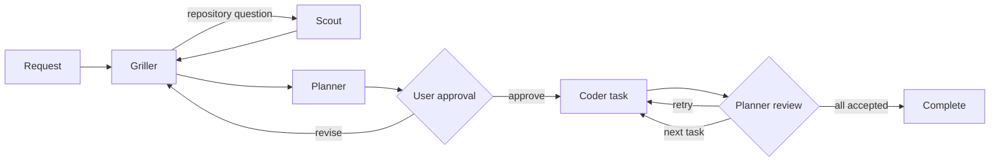
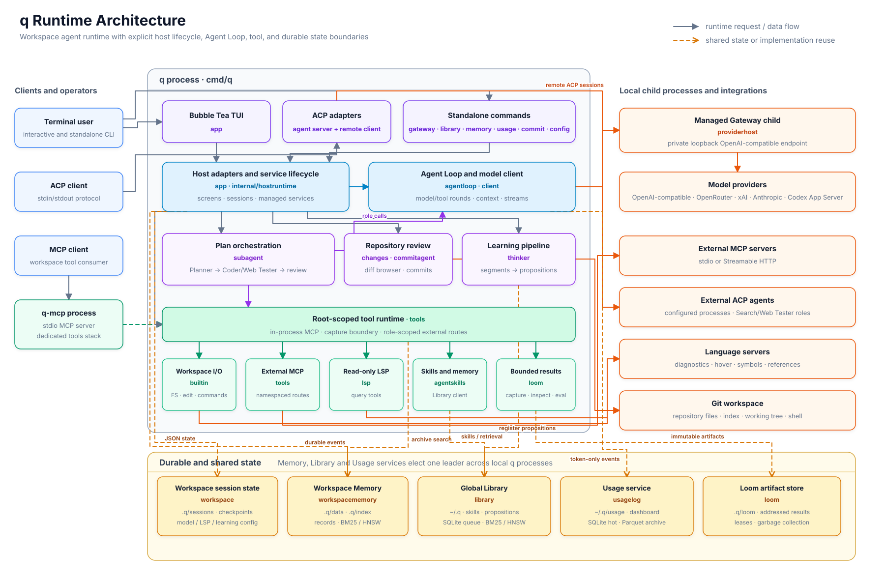

# q

`q` is a workspace-native coding agent for the terminal. It combines a Bubble
Tea chat interface, a managed multi-provider LLM gateway, approval-gated plan
execution, durable workspace history, and a root-scoped tool runtime in one Go
binary.

Use it for ordinary repository work, run a reviewed multi-agent plan, inspect
the resulting diff, and create a commit without leaving the terminal.

## What q includes

- **Workspace tools** — anchored reads and edits, complete-file writes,
  directory operations, asynchronous commands, archive search, and optional
  read-only LSP queries.
- **Explicit orchestration** — Griller, Scout, Planner, Coder, and review roles
  with user approval before a `/plan` starts modifying files.
- **Provider choice** — OpenAI-compatible APIs and local servers, OpenRouter,
  xAI, Anthropic, and the Codex App Server, all exposed through q's managed
  Gateway.
- **Durable sessions** — independent conversation projections, resumable plan
  checkpoints, searchable history, and optional semantic retrieval.
- **Bounded tool output** — large tool results are captured as immutable Loom
  artifacts instead of being copied through every prompt.
- **Repository review** — a syntax-highlighted `/changes` browser and a guided
  Conventional Commit workflow.
- **Extensibility** — external MCP servers, portable Agent Skills, ACP agent
  connections, and a standalone `q-mcp` server.

## Requirements

- Go 1.26.5 or later
- Git on `PATH`
- At least one configured model provider
- A terminal with ANSI color support

[Task](https://taskfile.dev/) is optional; the same build and test commands can
be run directly with Go.

## Install and run

From a source checkout:

```powershell
go install ./cmd/q ./cmd/q-mcp
```

Or run q without installing it:

```powershell
go run ./cmd/q
```

With Task:

```powershell
task install       # install q and q-mcp into the Go binary directory
task run           # run q from source
task build         # build both commands into ./bin
task test          # test q, the ACP SDK fork, and generated bindings
task dist:check    # verify versioned installation in an isolated module proxy
```

Start q from the repository or directory you want it to treat as the workspace:

```powershell
cd C:\path\to\project
q
```

Run a complete plan non-interactively with both clarification resolution and
plan approval forced on for that invocation:

```powershell
q sprint implement the requested feature
```

Sprint creates a fresh durable workspace session, runs the same
Griller → Scout → Planner → Coder → Planner review workflow as `/plan`, and
streams concise progress plus the final execution result to stdout. It does not
change the persisted `plan.auto_resolve` or `plan.auto_approve` settings.

Run the `/debug` investigation workflow non-interactively with clarification
auto-resolution forced for only that invocation:

```powershell
q diagnose investigate the session replacement failure
```

Diagnose creates a fresh durable workspace session, runs the same read-only
Griller → Scout → Planner report workflow as `/debug`, and streams concise
progress plus the final diagnostic report to stdout. It does not expose a
`/diagnose` command, modify persisted automation settings, or execute a fix.
Its audit log is written below `.q/debug-executions`.

Review the current Git working-tree changes without opening the TUI:

```powershell
q review
q review focus on concurrency and cancellation behavior
```

Review creates a fresh durable workspace session and asks the configured
Advisor to inspect bounded staged, unstaged, and untracked evidence. The
Advisor delegates repository questions to Scout and can use the configured
external Search agent for public evidence; both results return as Loom
receipts. The workflow reports actionable findings with file locations and
never edits files, builds or tests the project, runs project scripts, or changes
Git state. The optional trailing text narrows the review request. Its audit log
is written below `.q/review-executions`; no `/review` command is exposed in the
TUI or ACP.

On first launch, q opens provider setup. Prefer an environment variable for an
API key instead of storing a key inline. After selecting a model, type a request
normally or type `/` to open command completion.

## TUI guide

The main screen keeps the transcript, active agent progress, input, and status
visible together. `Ctrl+H` opens the complete in-app key reference from any q
screen and returns to the previous screen without discarding its state.

### Slash commands

| Command | Purpose |
|---|---|
| `/plan [request]` | Clarify, research, propose, approve, execute, and review a plan. |
| `/debug [issue]` | Clarify and research an issue, then have Planner return a diagnostic report without modifying the workspace. |
| `/auto-approve [on\|off\|status]` | Persistently control automatic approval of valid plan proposals. |
| `/auto-resolve [on\|off\|status]` | Persistently control engineering-default answers to plan clarification. |
| `/autonomous [on\|off\|status]` | Persistently control both plan automation settings together. |
| `/agent:search <query>` | Run the configured external ACP Search agent in a temporary read-only session. |
| `/changes` | Browse current staged, unstaged, and untracked repository changes. |
| `/commit` | Generate and review a commit or split-commit proposal. |
| `/sessions` | Open another saved workspace session. |
| `/new` | Create and switch to a new session. |
| `/clear` | Clear the current conversation projection and plan checkpoint. |
| `/learn [on\|off\|status]` | Checkpoint or control durable conversation learning. |
| `/model` | Assign models or fallback groups to the default and agent roles. |
| `/gateway` | Configure Gateway providers, listener settings, and API keys. |
| `/library` | Configure the global Library listener. |
| `/loom` | Inspect Loom usage and configure or run garbage collection. |
| `/ignore` | Edit workspace discovery rules in `.qignore`. |
| `/skills` | Manage global and project Agent Skills. |
| `/lsp` | Configure language servers and project roots. |
| `/mcp` | Configure external MCP servers and role assignments. |
| `/agents` | Configure ACP agent processes and the external Search role. |
| `/help` | Open the scrollable command and key guide. |

Start typing a slash command to filter the catalog. Up/Down selects an entry;
Tab or Enter completes it. Enter runs a command that is already complete, and
Escape closes the completion popup.

### Chat keys

| Key | Action |
|---|---|
| `Enter` / `Ctrl+S` | Send the current message. |
| `Shift+Enter` | Insert a newline. |
| `Ctrl+O` | Collapse or expand tool result bodies. |
| `Ctrl+G` | Collapse or expand the detailed subagent trace. |
| `Ctrl+L` | Clear the current chat projection. |
| `Ctrl+P` | Open Gateway settings. |
| `Ctrl+H` | Open or close help. |
| `Ctrl+C` | Interrupt an active turn; quit while idle. |
| `Esc` | Leave the current screen or quit chat. |

Assistant messages render as terminal Markdown. Supported streaming providers
show reasoning and response text separately; tool calls and agent progress are
updated as they run.

### Reviewing changes

`/changes` is a read-only view of the enclosing Git repository. It includes
changes that existed before the current q turn, so it is a repository view and
not a per-turn audit log. q-owned `.q` metadata is excluded.

- Up/Down or `j`/`k` selects a file.
- Enter focuses its diff; Tab switches between the file and diff panes.
- PageUp/PageDown scrolls vertically; Left/Right scrolls long lines.
- `r` reloads the repository; Escape returns to chat.

Staged and unstaged patches are displayed separately, even when they cancel one
another relative to `HEAD`. Known languages use Chroma syntax highlighting over
addition and deletion backgrounds. Unknown and oversized sources fall back to
plain text. Binary files show a notice. Each selected patch preview is limited
to 256 KiB or 4,000 lines and is clearly marked when partial. Opening this view
does not stage, commit, or modify files.

## Planning and execution

Use `/plan` when work should be clarified, explicitly approved, divided into
reviewed tasks, or recoverable after interruption. Ordinary chat requests can
still use tools directly; they do not enter this workflow automatically.



The Griller asks only for decisions that repository evidence cannot answer.
Scout performs bounded, non-mutating investigation. Planner produces conditions,
targets, completion criteria, and verification. After approval, Coder executes
one task at a time and Planner either accepts it or returns actionable retry
feedback.

Plan automation can be persisted in `~/.q/config.yaml`:

```yaml
plan:
  auto_resolve: true
  auto_approve: true
```

`auto_resolve` answers Griller requirement questions with an engineering policy
that requires both a small extensible abstraction and an efficient concrete
implementation. `auto_approve` mechanically approves a valid Planner proposal;
it does not bypass proposal validation, Coder execution, or Planner review.

Active execution is checkpointed under the selected session:

```text
.q/sessions/<uuid>/plan-execution.json
```

After an interruption, q offers Resume, Inspect, and Discard. Discarding a
checkpoint never reverts files already changed. Completed snapshots move to
`.q/plan-executions/` for manual inspection and cleanup.

Detailed contracts live in [plan orchestration](docs/plan-orchestration.md) and
[execution orchestration](docs/execution-orchestration.md).

## Commit workflow

Run `/commit` in chat or launch the standalone UI:

```powershell
q commit
```

q uses existing staged changes. If the index is empty, it stages current
working-tree changes while excluding q's root `.q` metadata. It then generates
a Conventional Commit or split-commit proposal with the configured `commit`
model. The captured index is verified again before any commit is created.

In the review screen, use Up/Down to select a split message, `e` to edit,
`Ctrl+S` to save an edit, `r` to regenerate, Enter to commit, `p` to commit and
push, or Escape to cancel. Push requires an existing upstream.

## Providers and model roles

Provider setup supports:

- OpenAI-compatible HTTP APIs, including local servers
- OpenRouter
- xAI/Grok
- Anthropic's native Messages API
- the local Codex App Server using the current Codex login

An ordinary q session supervises a managed Gateway child bound to an ephemeral
loopback port. `/gateway` edits providers and starts a replacement before it
activates new settings, so a failed replacement does not discard the running
configuration. The standalone `q gateway` command is a separate,
user-addressable server with its own listener and API-key settings.

`/model` assigns a model to the main chat and specialized roles such as
`griller`, `scout`, `planner`, `coder`, `commit`, `thinker`, and `librarian`.
Assignments may reference ordered model groups. A group can fall back after a
candidate timeout or transient HTTP 5xx response; user cancellation, tool
failure, and validation errors do not trigger fallback.

Global configuration is stored under `~/.q`. Workspace model overrides are in
`.q/model.json`. Use the TUI for normal configuration; edit YAML/JSON directly
only when automation requires it.

## Sessions, history, and learning

Each workspace can hold multiple UUID-based sessions. The startup picker shows
their titles and recent activity. One process owns a selected session, while a
different session in the same workspace may be opened concurrently. Session
locks coordinate conversation state; they do not serialize edits to project
files.

The current transcript and the compacted request context are persisted
separately. When context metadata is available, q compacts model context while
leaving the complete visible transcript intact. Workspace Memory stores durable
messages, tool activity, failures, lifecycle events, and search indexes.

After successful turns, Thinker can extract reusable propositions. Librarian
decides whether each proposition should be created, merged, or discarded in the
global Library. `/learn off` stops collection and queue processing without
deleting already queued data.

See [Session Store notes](docs/session-store-notes.md),
[Workspace Memory](docs/workspace-memory.md), and
[Global Library](docs/library.md) for storage and ownership details.

## Tools and integrations

### Builtin workspace tools

The model can read and edit files, write complete files, list and manipulate
paths, and launch asynchronous shell commands. File operations are jailed to
the workspace and hash-anchored edits reject stale context. Shell commands start
inside the workspace but are **not an OS sandbox**.

Every non-Loom tool result is captured before it returns to the model. Small
results remain inline; large results return a bounded `loom_ref` receipt. The
model can inspect or transform selected artifacts with `loom_inspect`,
`loom_read`, and restricted `loom_eval`.

### External MCP servers

Use `/mcp` or `q mcp` to configure stdio or Streamable HTTP MCP servers and
assign them to individual roles. Imported names are namespaced to prevent
collisions, and each result passes through the same Loom capture boundary.
Environment and header settings refer to environment-variable names rather
than storing credential values inline.

### Agent Skills

q implements the portable [`SKILL.md` Agent Skills
format](https://agentskills.io/specification). It searches indexed metadata
instead of injecting the complete catalog into every prompt. Skills are
discovered, in increasing precedence, from:

```text
~/.agents/skills/
~/.q/skills/
<workspace>/.agents/skills/
<workspace>/.q/skills/
```

`/skills` can clone, fast-forward, remove, and reindex q-managed global or
project skills. See [Agent Skills](docs/agent-skills.md) for validation,
shadowing, indexing, and tool access rules.

### Language servers

`/lsp` or `q lsp` configures global language-server profiles and workspace
project roots. q exposes diagnostics, hover, definitions, references, document
symbols, and workspace symbols as read-only tools. It rejects
`workspace/applyEdit` and does not expose rename, formatting, code-action
execution, or arbitrary server commands.

See [LSP integration](docs/lsp.md) for discovery, routing, synchronization, and
failure behavior.

### Discovery and `.qignore`

`.qignore` filters directory discovery and root listings. It supports comments,
negation, root anchoring, directory suffixes, and `*`, `**`, and `?` wildcards.
It is a discovery aid, **not an access-control boundary**: a tool can still read
an explicitly requested in-workspace path.

## ACP and standalone services

### ACP agent mode

Run q as an Agent Client Protocol server over stdin/stdout:

```powershell
q acp [--root <workspace-path>] [--auto-resolve] [--auto-approve] [--autonomous]
```

ACP mode shares q's sessions, workspace tools, planning, external Search, and
commit workflow. The plan flags override persisted settings for only that ACP
process; explicit values such as `--auto-approve=false` are also supported.
`--autonomous` enables both plan flags, while an explicitly supplied individual
flag takes precedence. `/plan` and `/commit` use form elicitation when available.
Otherwise, plan and commit approvals use numbered actions, while planning and
agent questions consume the next message as a free-form answer. Git changes and
plan execution still require explicit approval.

The TUI and ACP both expose `/auto-approve`, `/auto-resolve`, and `/autonomous`
with `on`, `off`, and `status` actions. A bare command is equivalent to `status`;
`on` and `off` persist to `~/.q/config.yaml`. ACP status distinguishes the saved
configuration from the effective value when a process-only CLI flag overrides it.
Client-provided stdio and Streamable HTTP MCP servers are scoped to their ACP
session. SSE transport is not supported.

q advertises ACP embedded-context support and preserves resource URI, MIME type,
annotations, and contents when sessions are replayed. When the TUI is connected
to an external ACP agent, `@relative/path` attaches an in-workspace file;
`@"path with spaces"` is also accepted. q embeds the file when the remote agent
advertises embedded context and otherwise sends an ACP resource link.

### Workspace MCP server

Expose q's builtin workspace tools to another MCP client:

```powershell
q-mcp -root C:\path\to\workspace
```

`q-mcp` uses stdio, applies the same root jail and Loom limits, and deliberately
omits the chat-only `learn` tool.

### Standalone commands

| Command | Purpose |
|---|---|
| `q sprint <request...>` | Run one autonomous plan through execution and review. All trailing argv values are joined as the request. |
| `q diagnose <issue...>` | Run one autonomous read-only investigation and archive its diagnostic report. |
| `q review [request...]` | Review current working-tree changes with the read-only Advisor and archive the report. |
| `q gateway [--host <ip>] [--port <port>]` | Run the OpenAI-compatible Gateway. |
| `q gateway config` | Configure its listener, API keys, and providers. |
| `q library` / `q library config` | Run or configure the global Library. |
| `q memory` | Keep Workspace Memory running independently of a TUI. |
| `q commit` | Open the commit workflow in the current repository. |
| `q model` | Configure model and role assignments. |
| `q agents` | Configure ACP agent connections and Search. |
| `q mcp` | Configure external MCP servers. |
| `q skills` | Manage Agent Skills. |
| `q lsp` | Configure language servers. |
| `q ignore` | Edit `.qignore`. |
| `q help` | Open the TUI help without starting chat services. |

Ordinary q processes automatically ensure Workspace Memory and the global
Library are available. Run the standalone service commands when their lifetime
should not depend on an interactive session.

The standalone Gateway initially binds to `127.0.0.1:0`. If it has no active
API keys, authentication is disabled. Do not expose a no-key Gateway on a
non-loopback address unless the surrounding network already enforces access.

## Data and configuration

### Personal state

| Path | Purpose |
|---|---|
| `~/.q/config.yaml` | Main model, roles, context, Loom, and LSP configuration. |
| `~/.q/providers.json` | Managed Gateway providers and model metadata. |
| `~/.q/gateway.json` | Standalone Gateway listener and key metadata. |
| `~/.q/library.json` | Global Library listener settings. |
| `~/.q/workspace-memory.json` | Workspace Memory settings. |
| `~/.q/mcp.json` | External MCP profiles and role assignments. |
| `~/.q/skills/` | q-managed global Agent Skills. |

Authentication master keys and the Workspace Memory token are stored in
separate files under `~/.q`. Prefer environment variables for provider and MCP
credentials. POSIX permissions are restricted by q; Windows file modes do not
manage ACLs.

### Workspace state

| Path | Purpose |
|---|---|
| `.q/sessions/<uuid>/session.json` | Transcript, compacted context, title, task lifecycle, and learning state. |
| `.q/sessions/<uuid>/plan-execution.json` | Resumable approved-plan checkpoint. |
| `.q/plan-executions/` | Completed execution snapshots. |
| `.q/model.json` | Workspace model-role overrides. |
| `.q/learning.json` | Workspace learning switch. |
| `.q/lsp.json` | Workspace LSP roots and overrides. |
| `.q/data/` and `.q/index/` | Durable history records and derived indexes. |
| `.q/loom/` | Content-addressed tool artifacts and GC metadata. |
| `.q/skills/` | q-managed project Agent Skills. |
| `.qignore` | Discovery exclusions. |

The JSON records are the source of truth; Bleve and HNSW data are derived and
rebuildable. Loom garbage collection protects references from active session
projections and plan checkpoints, subject to its configured grace period.

## Runtime layout

An interactive q process coordinates components with separate ownership:

[](docs/architecture.drawio)

Editable source: [docs/architecture.drawio](docs/architecture.drawio).

| Component | Lifetime and responsibility |
|---|---|
| TUI | One selected session, chat lifecycle, and user interaction. |
| Managed Gateway child | Provider aggregation for that q process on a private loopback endpoint. |
| Workspace runtime | Root-scoped tools and local LSP sessions. |
| Workspace Memory | Durable records and Bleve/HNSW indexes for leased workspace roots. |
| Global Library | Shared skills, propositions, search indexes, and judging queue. |

This separation allows several q processes to share durable services without
sharing a chat session or provider conversation lifecycle.

## Development

The repository's `go.work` connects the root module, q's maintained ACP SDK
fork, and its generator. Keep workspace mode enabled when developing them
together.

```powershell
go test ./...
go vet ./...
task test
task build
task dist:check
```

`task test` also tests the nested ACP modules and checks generated binding
drift. See [ACP fork maintenance](docs/acp-go-sdk-patch.md) before updating or
publishing the fork.

### Design notes

- [Agent invocation runtime](docs/agent-invocation-runtime.md)
- [Subagent architecture](docs/subagent-architecture-notes.md)
- [Plan orchestration](docs/plan-orchestration.md)
- [Execution orchestration](docs/execution-orchestration.md)
- [Context compaction](docs/context-compaction-plan.md)
- [Session Store](docs/session-store-notes.md)
- [Workspace Memory](docs/workspace-memory.md)
- [Global Library](docs/library.md)
- [Agent Skills](docs/agent-skills.md)
- [LSP integration](docs/lsp.md)
