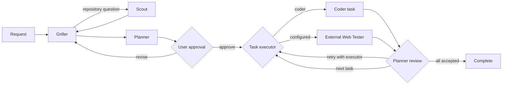

# q

`q` is a workspace-native coding agent for the terminal. It combines a Bubble
Tea chat interface, a managed multi-provider LLM gateway, approval-gated plan
execution, durable workspace history, and a root-scoped tool runtime in one Go
binary.

Use it for ordinary repository work, run a reviewed multi-agent plan, inspect
the resulting diff, and create a commit without leaving the terminal.

[Documentation](https://q.saturday.ne.kr) · [Source](https://github.com/snowmerak/q)

## What q includes

- **Workspace tools** — anchored reads and edits, complete-file writes,
  directory operations, asynchronous commands, archive search, and optional
  read-only LSP queries.
- **Explicit orchestration** — Griller, Scout, Planner, Coder, optional external
  Web Tester, and review roles with user approval before a `/plan` executes.
- **Provider choice** — OpenAI-compatible APIs and local servers, OpenRouter,
  xAI, Anthropic, and the Codex App Server, all exposed through q's managed
  Gateway.
- **Durable sessions** — independent conversation projections, resumable plan
  checkpoints, searchable history, and optional semantic retrieval.
- **Bounded tool output** — large tool results are captured as immutable Loom
  artifacts instead of being copied through every prompt.
- **Repository review** — a syntax-highlighted `/changes` browser and a guided
  Conventional Commit workflow.
- **Extensibility** — external MCP servers, portable Agent Skills, ACP agent
  connections, and a standalone `q-mcp` server.

## Requirements

- Go 1.26.5 or later
- Git on `PATH`
- At least one configured model provider
- A terminal with ANSI color support

[Task](https://taskfile.dev/) is optional; the same build and test commands can
be run directly with Go.

## Install and run

Install the latest q binary directly from the Go module:

```powershell
go install github.com/snowmerak/q/cmd/q@latest
```

Install the optional `q-mcp` companion the same way:

```powershell
go install github.com/snowmerak/q/cmd/q-mcp@latest
```

From a source checkout, install both commands together:

```powershell
go install ./cmd/q ./cmd/q-mcp
```

Or run q without installing it:

```powershell
go run ./cmd/q
```

With Task:

```powershell
task install       # install q and q-mcp into the Go binary directory
task run           # run q from source
task build         # build both commands into ./bin
task test          # test q, the ACP SDK fork, and generated bindings
task dist:check    # verify versioned installation in an isolated module proxy
```

Start q from the repository or directory you want it to treat as the workspace:

```powershell
cd C:\path\to\project
q
```

Run a complete plan non-interactively with both clarification resolution and
plan approval forced on for that invocation:

```powershell
q sprint implement the requested feature
```

Sprint creates a fresh durable workspace session, runs the same
Griller → Scout → Planner → task executor → Planner review workflow as `/plan`, and
streams concise progress plus the final execution result to stdout. It does not
change the persisted `plan.auto_resolve` or `plan.auto_approve` settings.

On first launch, q opens provider setup. Prefer an environment variable for an
API key instead of storing a key inline. After selecting a model, type a request
normally or type `/` to open command completion.

## TUI guide

The main screen keeps the transcript, active agent progress, input, and status
visible together. `Ctrl+H` opens the complete in-app key reference from any q
screen and returns to the previous screen without discarding its state.

### Slash commands

| Command | Purpose |
|---|---|
| `/plan [request]` | Clarify, research, propose, approve, execute, and review a plan. |
| `/auto-approve [on\|off\|status]` | Persistently control automatic approval of valid plan proposals. |
| `/auto-resolve [on\|off\|status]` | Persistently control engineering-default answers to plan clarification. |
| `/autonomous [on\|off\|status]` | Persistently control both plan automation settings together. |
| `/changes` | Browse current staged, unstaged, and untracked repository changes. |
| `/commit` | Generate and review a commit or split-commit proposal. |
| `/sessions` | Open another saved workspace session. |
| `/new` | Create and switch to a new session. |
| `/clear` | Clear the current conversation projection and plan checkpoint. |
| `/learn [on\|off\|status]` | Checkpoint or control durable conversation learning. |
| `/model` | Assign models, manage native roles, and configure fallback groups. |
| `/gateway` | Configure Gateway providers, listener settings, and API keys. |
| `/library` | Configure the global Library listener. |
| `/loom` | Inspect Loom usage and configure or run garbage collection. |
| `/ignore` | Edit workspace discovery rules in `.qignore`. |
| `/skills` | Manage global and workspace Agent Skills. |
| `/lsp` | Configure language servers and project roots. |
| `/mcp` | Configure external MCP servers and role assignments. |
| `/subagents [list\|show <name>]` | Manage builtin/custom subagents, external bindings, and ACP connections. |
| `/subagent <name> <request>` | Run a public builtin or custom subagent. |
| `/help` | Open the scrollable command and key guide. |

Start typing a slash command to filter the catalog. Up/Down selects an entry;
Tab or Enter completes it. Enter runs a command that is already complete, and
Escape closes the completion popup.

External subagents are invoked through `/subagent builtin/web-search <query>` or
`/subagent builtin/web-tester <request>`. Availability depends on assigning the
builtin to an existing enabled ACP connection in `/subagents`. The same rule
controls general-chat tools and Planner executor choices.

Web Tester invocations run in an isolated ACP process/session with a fixed
15-minute deadline. q automatically selects `allow_once`, falling back to an
offered `allow_always`; if neither is available, the invocation fails. Assigning
the Web Tester role therefore marks that executable as trusted for autonomous
verification. Search keeps its read-only permission policy.

### Chat keys

| Key | Action |
|---|---|
| `Enter` / `Ctrl+S` | Send the current message. |
| `Shift+Enter` | Insert a newline. |
| `Ctrl+O` | Collapse or expand tool result bodies. |
| `Ctrl+G` | Collapse or expand the detailed subagent trace. |
| `Ctrl+L` | Clear the current chat projection. |
| `Ctrl+P` | Open Gateway settings. |
| `Ctrl+H` | Open or close help. |
| `Ctrl+C` | Interrupt an active turn; quit while idle. |
| `Esc` | Leave the current screen or quit chat. |

Assistant messages render as terminal Markdown. Supported streaming providers
show reasoning and response text separately; tool calls and agent progress are
updated as they run.

### Reviewing changes

`/changes` is a read-only view of the enclosing Git repository. It includes
changes that existed before the current q turn, so it is a repository view and
not a per-turn audit log. q-owned `.q` metadata is excluded.

- Up/Down or `j`/`k` selects a file.
- Enter focuses its diff; Tab switches between the file and diff panes.
- PageUp/PageDown scrolls vertically; Left/Right scrolls long lines.
- `r` reloads the repository; Escape returns to chat.

Staged and unstaged patches are displayed separately, even when they cancel one
another relative to `HEAD`. Known languages use Chroma syntax highlighting over
addition and deletion backgrounds. Unknown and oversized sources fall back to
plain text. Binary files show a notice. Each selected patch preview is limited
to 256 KiB or 4,000 lines and is clearly marked when partial. Opening this view
does not stage, commit, or modify files.

## Planning and execution

Use `/plan` when work should be clarified, explicitly approved, divided into
reviewed tasks, or recoverable after interruption. Ordinary chat requests can
still use tools directly; they do not enter this workflow automatically.



The Griller asks only for decisions that repository evidence cannot answer.
Scout performs bounded, non-mutating investigation. Planner produces conditions,
targets, executors, completion criteria, and verification. After approval, each
task starts with its planned executor. Planner can send a failed Web Tester result
to Coder for repair and then back to Web Tester for acceptance; tasks still run
sequentially and share the existing bounded attempt count.

Plan automation can be persisted in `~/.q/config.yaml`:

```yaml
plan:
  auto_resolve: true
  auto_approve: true
```

`auto_resolve` answers Griller requirement questions with an engineering policy
that requires both a small extensible abstraction and an efficient concrete
implementation. `auto_approve` mechanically approves a valid Planner proposal;
it does not bypass proposal validation, executor execution, or Planner review.

Active execution is checkpointed under the selected session:

```text
.q/sessions/<uuid>/plan-execution.json
```

After an interruption, q offers Resume, Inspect, and Discard. Discarding a
checkpoint never reverts files already changed. Completed snapshots move to
`.q/plan-executions/` for manual inspection and cleanup.

Detailed contracts live in [plan orchestration](docs/plan-orchestration.md) and
[execution orchestration](docs/execution-orchestration.md).

## Commit workflow

Run `/commit` in chat or launch the standalone UI:

```powershell
q commit
```

q uses existing staged changes. If the index is empty, it stages current
working-tree changes while excluding q's root `.q` metadata. It then generates
a Conventional Commit or split-commit proposal with the configured `commit`
model. The captured index is verified again before any commit is created.

In the review screen, use Up/Down to select a split message, `e` to edit,
`Ctrl+S` to save an edit, `r` to regenerate, Enter to commit, `p` to commit and
push, or Escape to cancel. Push requires an existing upstream.

## Providers and model roles

Provider setup supports:

- OpenAI-compatible HTTP APIs, including local servers
- OpenRouter
- xAI/Grok
- Anthropic's native Messages API
- the local Codex App Server using the current Codex login

An ordinary q session supervises a managed Gateway child bound to an ephemeral
loopback port. `/gateway` edits providers and starts a replacement before it
activates new settings, so a failed replacement does not discard the running
configuration. The standalone `q gateway start` command is a separate,
user-addressable server with its own listener and API-key settings. Both forms
record provider-reported token usage in the user-level `q usage` service.

`/model` assigns a model to the main chat and specialized roles such as
`griller`, `scout`, `planner`, `executor`, `coder`, `commit`, `thinker`, and `librarian`.
Press `a` in the assignment table to create a reusable custom role and `d` to
delete an unreferenced custom role after confirmation.
Assignments may reference ordered model groups. A group can fall back after a
candidate timeout or transient HTTP 5xx response; user cancellation, tool
failure, and validation errors do not trigger fallback.

Global configuration is stored under `~/.q`. Workspace model overrides are in
`.q/model.json`. Use the TUI for normal configuration; edit YAML/JSON directly
only when automation requires it.

## Subagents

Open `/subagents` in the TUI to inspect builtin definitions and manage runnable custom
profiles. Inner and external execution are shown by the stored `kind`, not by an ID namespace.
Builtin inner entries are fixed definitions; their access label reflects both direct tools and
delegates. Pressing `e` on a builtin external entry changes only
its ACP binding; its built-in system prompt remains fixed. Press `c` to register, edit, test,
enable, disable, or delete shared ACP connections. For custom entries, `a` adds, `e` edits,
and `d` deletes the selected profile after confirmation. Each list row summarizes
its model role, scope, tool state, and delegation grants.
In an editor, Tab or Up/Down selects fields, Enter advances from name and
description or opens a scope/kind/role/ACP/tool/delegate picker, Ctrl+S saves, and Esc cancels.
Inside the multiline prompt, Enter inserts a newline and arrows move the cursor;
Tab moves to the next field; Shift+Tab, Esc, or Ctrl+Up returns to the previous
field without discarding the prompt. Scope and Role cycle with Left/Right or
Space; Enter opens their selection list. Tools and Delegates open searchable lists;
Space or Enter toggles selections. Tab/Shift+Tab leaves a list for the next/previous
field, and Esc returns to that field.
Ctrl+S or F2 saves from any editor field or open selection list. You can also
Tab to the final Save action and press Enter. Validation errors keep
the draft available for correction. The system prompt supports multiple lines.

A profile is either `inner` or `external`. An inner profile combines a system prompt, an
explicit tool list, directly callable subagents, and a native model role. A custom role uses the existing model,
model-group, and reasoning settings
in `~/.q/config.yaml`. Manage role assignments from `/model`: `a` creates a
custom role and `d` deletes one after confirmation. Built-in native roles can
also be selected; selecting one uses its model settings without invoking its
built-in workflow.
The names `default`, `embedding`, `search`, `external_web_tester`, and built-in role names are reserved
and cannot be registered as custom roles.

Profiles are YAML files in `~/.q/subagents/` or `<workspace>/.q/subagents/`.
A workspace profile replaces the entire global profile with the same name.
Changes apply on the next invocation. Existing profile and role names are fixed
when editing. Changing a profile's scope moves its file without overwriting an
existing profile at the destination. A referenced custom role must be reassigned
in the known global and current-workspace profiles before deletion from `/model`.
A profile referenced by another profile's `delegates` cannot be deleted from the
TUI until that grant is removed.

An external profile instead stores an ACP connection, a system prompt, and whether the
connection may mutate the workspace. It does not select a q model role, q tools, or delegates.
ACP has no system-message field in its session-creation contract, so q prepends the stored
system prompt to the first ordinary ACP prompt before the explicit request. Disabled or missing
connections make the profile unavailable without deleting it.

```yaml
version: 1
name: code-reader
description: Explain the requested code.
kind: inner
role: scout
system_prompt: |
  Read the requested code and explain its behavior with concrete file references.
tools:
  - list_directory
  - read_file
delegates:
  - builtin/scout
```

```yaml
version: 1
name: browser-check
description: Verify browser behavior through an ACP agent.
kind: external
agent: browser
system_prompt: |
  Verify only the requested browser behavior and report observed evidence.
mutates_workspace: true
tools: []
delegates: []
```

TUI and ACP support `/subagents list`, `/subagents show code-reader`, and
`/subagent code-reader explain the cancellation handling in app/model.go`.
The public builtin IDs are `builtin/scout`, `builtin/griller`, `builtin/planner`,
`builtin/executor`, `builtin/reviewer`, `builtin/coder`, `builtin/web-search`, and
`builtin/web-tester`.
The latter two have `kind: external`; other external agents use their normal
`global/...` or `workspace/...` profile ID. Bare `/subagents` opens the profile UI
in the TUI and lists all available definitions in ACP. Creation, editing, and
deletion use the TUI or profile files. Pass all necessary task context in the
request: the child does not automatically inherit the parent conversation.
`tools: []` and `delegates: []` grant nothing. Delegation grants use canonical
IDs (`builtin/...`, `global/...`, or `workspace/...`). Unavailable tools, roles,
or delegates produce an error before the model runs.

Inner delegated agents share the host-provided `task_start` and `task_complete`
lifecycle. External delegates bypass native model and tool scoping and use their existing ACP
invocation adapter and Loom capture. General chat receives `delegate_list` and `delegate`; custom agents
receive them only when their profile has direct grants. `/plan` and `q sprint`
retain their approval-gated Go workflow and internal Coder/Planner review.
The public Planner delegates an explicitly execution-bearing request to the public Executor;
planning-only requests stop after the plan. The Executor runs Coder attempts, sends their results
to Reviewer, and passes retry feedback back to Coder without holding workspace mutation tools itself.

## Sessions, history, and learning

Each workspace can hold multiple UUID-based sessions. The startup picker shows
their titles and recent activity. One process owns a selected session, while a
different session in the same workspace may be opened concurrently. Session
locks coordinate conversation state; they do not serialize edits to project
files.

The current transcript and the compacted request context are persisted
separately. When context metadata is available, q compacts model context while
leaving the complete visible transcript intact. Workspace Memory stores durable
messages, tool activity, failures, lifecycle events, and search indexes.

After successful turns, Thinker can extract reusable propositions. A successful
task result may support durable project facts, reusable resolutions, and
evidence-backed research findings without a separate user confirmation. Thinker
keeps only findings likely to influence future technical choices or actions and
remain useful across multiple tasks, including established workflows and
recurring behavior patterns. Project-specific propositions use a stable project
name and workspace-relative file paths; the host's absolute working directory is
scope input only and is never persisted in proposition content, queries, or
tags. Run-specific test, formatting, audit, and build snapshots remain in task
history. Thinker also preserves whether a result is merely recommended or
actually adopted. Librarian decides whether each proposition should be created,
merged, or discarded in the global Library. `/learn off` stops collection and
queue processing without deleting already queued data. Each completed or failed
Thinker invocation also writes a short-lived diagnostic JSON file below
`~/.q/logs/thinker/`; files older than three days are removed when the next
Thinker log is written. In-flight proposition writes use a private per-session
write-ahead checkpoint, so a restart replays the exact payload and idempotency
key before the model can generate another proposition for that slot.

See [Session Store notes](docs/session-store-notes.md),
[Workspace Memory](docs/workspace-memory.md), and
[Global Library](docs/library.md) for storage and ownership details.

## Tools and integrations

### Builtin workspace tools

The model can read and edit files, write complete files, list and manipulate
paths, and launch asynchronous shell commands. File operations are jailed to
the workspace and hash-anchored edits reject stale context. Shell commands start
inside the workspace but are **not an OS sandbox**.

Every non-Loom tool result is captured before it returns to the model. Small
results remain inline; large results return a bounded `loom_ref` receipt. The
model can inspect or transform selected artifacts with `loom_inspect`,
`loom_read`, and restricted `loom_eval`.

### External MCP servers

Use `/mcp` or `q mcp` to configure stdio or Streamable HTTP MCP servers and
assign them to individual roles. Imported names are namespaced to prevent
collisions, and each result passes through the same Loom capture boundary.
Environment and header settings refer to environment-variable names rather
than storing credential values inline.

### Agent Skills

q implements the portable [`SKILL.md` Agent Skills
format](https://agentskills.io/specification) as an on-demand retrieval layer.
It keeps the full catalog and skill bodies out of the base prompt. For roles
with both skill tools, a new user turn or new information from `task_start` and
`ask_to_user` triggers a bounded metadata search that adds up to four
previously unseen candidate skills to the new context:

```text
new user/task information
  -> BM25 or hybrid metadata search
  -> bounded candidate hints
  -> get_skill for an applicable candidate
  -> full SKILL.md/resource in model context
```

Candidate metadata is not treated as an instruction: the model must call
`get_skill` before following a skill. Automatic search failure never blocks the
turn, and roles with skill tools can still call `search_skills` whenever later
work needs more guidance. Already hinted or loaded skill IDs are not suggested
again in the same context.

Without an embedding model, retrieval is BM25-only. With one, q combines BM25
and HNSW vector results; assigning a new embedding model rebuilds and backfills
the vector projection. Lexical matches rank skill name above tags and
description. Global and workspace results receive no scope bonus; when both
bounded result sets contain the same skill name, the workspace hit wins, and
`total` is computed after merging and de-duplication but before applying the
requested limit.

Dynamic hints are appended to the current user message or the new tool result,
never inserted ahead of an already-sent conversation prefix. The visible
transcript retains the original user text. This keeps earlier prompt content
eligible for provider prefix caching, although individual cache hits remain
provider-managed.

Skills are discovered, in increasing precedence, from:

```text
~/.agents/skills/
~/.q/skills/
<nearest-git-root>/.agents/skills/  # when distinct from the active workspace
<workspace>/.agents/skills/
<workspace>/.q/skills/
```

The Git-root lookup lets a q session started in a repository subdirectory use
the repository's portable skills without expanding the session's file-tool
jail. While q is running, skill use triggers a workspace reconciliation when
the previous check is at least 30 seconds old. Frontmatter `name` remains the
canonical skill name but does not have to match the directory, and
`description` is optional.

`/skills` can clone, fast-forward, remove, and reindex q-managed global or
workspace skills. See [Agent Skills](docs/agent-skills.md) for validation,
contextual hint bounds, indexing, prompt placement, and tool access rules.

### Workspace instructions

q automatically loads a workspace-root `AGENTS.md` as a bounded developer
instruction. Structured tool paths activate nested `AGENTS.md` files from the
root toward the target; the primary agent pauses the first affected tool batch
so it can review newly loaded rules before retrying. See [Workspace
instructions](docs/workspace-instructions.md) for precedence, subagent behavior,
path detection, and safety limits.

### Language servers

`/lsp` or `q lsp` configures global language-server profiles and workspace
project roots. q exposes diagnostics, hover, definitions, references, document
symbols, and workspace symbols as read-only tools. It rejects
`workspace/applyEdit` and does not expose rename, formatting, code-action
execution, or arbitrary server commands.

See [LSP integration](docs/lsp.md) for discovery, routing, synchronization, and
failure behavior.

### Discovery and `.qignore`

`.qignore` filters directory discovery and root listings. It supports comments,
negation, root anchoring, directory suffixes, and `*`, `**`, and `?` wildcards.
It is a discovery aid, **not an access-control boundary**: a tool can still read
an explicitly requested in-workspace path.

## Embedding the agent loop in Go

`agentloop.Run` exposes the same synchronous model/tool state machine used by
the TUI, ACP, and remote hosts. The embedding application supplies a
`ModelClient`, a `ToolRuntime`, history, and optional event/question hooks; it
retains ownership of dependency lifetimes and persistence.

```go
model, err := client.FromEnvironment("gpt-5")
if err != nil {
	return err
}
defer model.Close()

runtime, err := tools.NewRuntime(ctx, workspaceRoot)
if err != nil {
	return err
}
defer runtime.Close()

result, err := agentloop.Run(ctx, agentloop.Request{
	Client: model,
	Tools: runtime.ForRole(mcpconfig.RoleDefault),
	Messages: history,
	Model: "gpt-5",
	ContextPolicy: memory.Policy{
		ContextWindow: 128_000,
		TriggerRatio:  .85,
		TargetRatio:   .22,
		RecentRatio:   .07,
	},
}, agentloop.Hooks{})
```

`client.Client` implements `ModelClient`, including optional streaming.
`tools.Runtime` dispatches builtin tools through the Go MCP SDK, while
`ConfigureExternal` connects stdio or Streamable HTTP MCP servers. Pass
`runtime.ForRole(...)` to expose and enforce only the external MCP tools
assigned to that role. `Run` never closes these dependencies or writes session
state; persist `Result.Context` and selected events according to the host's own
session model. A zero `ContextPolicy.ContextWindow` disables automatic
compaction.

See [Embedding q's agent loop in Go](docs/agent-loop-embedding.md) for custom
model and tool adapters, MCP configuration, events, interactive questions, and
session ownership.

## ACP and standalone services

### ACP agent mode

Run q as an Agent Client Protocol server over stdin/stdout:

```powershell
q acp [--root <workspace-path>] [--auto-resolve] [--auto-approve] [--autonomous]
```

ACP mode shares q's sessions, workspace tools, planning, external Search/Web Tester, and
commit workflow. The plan flags override persisted settings for only that ACP
process; explicit values such as `--auto-approve=false` are also supported.
`--autonomous` enables both plan flags, while an explicitly supplied individual
flag takes precedence. `/plan` and `/commit` use form elicitation when available.
Otherwise, plan and commit approvals use numbered actions, while planning and
agent questions consume the next message as a free-form answer. Git changes and
plan execution still require explicit approval.

The TUI and ACP both expose `/auto-approve`, `/auto-resolve`, and `/autonomous`
with `on`, `off`, and `status` actions. A bare command is equivalent to `status`;
`on` and `off` persist to `~/.q/config.yaml`. ACP status distinguishes the saved
configuration from the effective value when a process-only CLI flag overrides it.
Client-provided stdio and Streamable HTTP MCP servers are scoped to their ACP
session. SSE transport is not supported.

q advertises ACP embedded-context support and preserves resource URI, MIME type,
annotations, and contents when sessions are replayed. When the TUI is connected
to an external ACP agent, `@relative/path` attaches an in-workspace file;
`@"path with spaces"` is also accepted. q embeds the file when the remote agent
advertises embedded context and otherwise sends an ACP resource link.

### Workspace MCP server

Expose q's builtin workspace tools to another MCP client:

```powershell
q-mcp -root C:\path\to\workspace
```

`q-mcp` uses stdio, applies the same root jail and Loom limits, and deliberately
omits the chat-only `learn` tool.

### Standalone commands

| Command | Purpose |
|---|---|
| `q sprint <request...>` | Run one autonomous plan through execution and review. All trailing argv values are joined as the request. |
| `q gateway` | Configure the Gateway listener, API keys, and providers. |
| `q gateway start [--host <ip>] [--port <port>]` | Run the OpenAI-compatible Gateway. |
| `q remote` | Run the foreground REST host for workspace sessions and agent execution. |
| `q remote config` | Configure the Remote listener, authentication switch, and Remote-only API keys. |
| `q library` | Configure the global Library listener. |
| `q library start` | Run the global Library as a dedicated foreground service. |
| `q memory` | Keep Workspace Memory running independently of a TUI. |
| `q usage` | Open the local token-usage dashboard and host its service when needed. |
| `q commit` | Open the commit workflow in the current repository. |
| `q model` | Configure model and role assignments. |
| `q subagents` | Manage subagents, external bindings, and ACP connections. (`q agents` is a compatibility alias.) |
| `q mcp` | Configure external MCP servers. |
| `q skills` | Manage Agent Skills. |
| `q lsp` | Configure language servers. |
| `q ignore` | Edit `.qignore`. |
| `q help` | Open the TUI help without starting chat services. |

Ordinary q processes automatically ensure Workspace Memory, the global Library,
and token Usage storage are available when needed. Run the standalone service
commands when their lifetime should not depend on an interactive session. The
internal data services bind only to a loopback IP address and accept local HTTP
requests without bearer authentication.

The standalone Gateway initially binds to `127.0.0.1:0`. If it has no active
API keys, authentication is disabled. Do not expose a no-key Gateway on a
non-loopback address unless the surrounding network already enforces access.
Calls without Q usage metadata appear under the bounded `gateway` role. A Q
client can opt in to role/event-ID forwarding; those headers are telemetry
classification, not authenticated caller identity, and the Gateway removes
them before provider dispatch.

The standalone Remote host also defaults to `127.0.0.1:0`, but uses an
independent keyring because a Remote key can select any working directory the
q process account can access and can run workspace-mutating tools. Configure it
with `q remote config`, then start it with `q remote`. `GET /v1/sessions` and
`GET /v1/subagents` discover workspace state; `POST /v1/subagent-runs` streams
execution as `application/x-ndjson`. The request requires `working_directory`
and `prompt`; `session_id` resumes a session, while omission creates one. The
`subagent` field is optional: an empty or omitted value runs the ordinary main
agent loop, and a value such as `builtin/scout` runs the existing direct
`/subagent` flow. Remote prompts are always model input; TUI-only slash commands
such as `/new` are not executed through the API.

Remote requests preserve `ask_to_user` in the model-visible tool catalog. Since
the HTTP stream is one-way, a call immediately receives an
`interaction_unavailable`-style tool error and the agent may continue with the
available information or finish blocked. Remote does not provide built-in TLS,
path allowlists, background jobs, reconnect, or interactive answers. Keep it on
loopback unless authentication and a trusted confidential network or reverse
proxy are in place. The exact wire contract is served from `/openapi.json` and
described in [the Remote API implementation note](docs/remote-subagent-api-plan.md).

## Data and configuration

### Personal state

| Path | Purpose |
|---|---|
| `~/.q/config.yaml` | Main model, roles, context, Loom, and LSP configuration. |
| `~/.q/providers.json` | Managed Gateway providers and model metadata. |
| `~/.q/gateway.json` | Standalone Gateway listener and key metadata. |
| `~/.q/remote.json` | Standalone Remote listener, authentication switch, and Remote key metadata. |
| `~/.q/remote.key` | Private master key used only to verify Remote API keys. |
| `~/.q/library.json` | Global Library loopback listener settings. |
| `~/.q/workspace-memory.json` | Workspace Memory settings. |
| `~/.q/usage.json` | Token Usage service loopback endpoint settings. |
| `~/.q/mcp.json` | External MCP profiles and role assignments. |
| `~/.q/skills/` | q-managed global Agent Skills. |
| `~/.q/logs/thinker/` | Private Thinker invocation diagnostics retained for three days. |
| `~/.q/usage/usage.sqlite` | Recent token-only events and all-time daily rollups. |
| `~/.q/usage/archive/` | Daily Parquet archives for raw events older than 90 days. |
| `~/.q/logs/model-usage/` | Legacy JSONL import source; successful import does not delete it. |

Gateway authentication master keys are stored separately under `~/.q`. Global
Library and Workspace Memory do not create or require authentication keys;
legacy `library.key` and `workspace-memory.token` files are ignored. Prefer
environment variables for provider and MCP credentials. POSIX permissions are
restricted by q; Windows file modes do not manage ACLs.

### Workspace state

| Path | Purpose |
|---|---|
| `.q/sessions/<uuid>/session.json` | Transcript, compacted context, title, task lifecycle, and learning state. |
| `.q/sessions/<uuid>/plan-execution.json` | Resumable approved-plan checkpoint. |
| `.q/plan-executions/` | Completed execution snapshots. |
| `.q/model.json` | Workspace model-role overrides. |
| `.q/learning.json` | Workspace learning switch. |
| `.q/lsp.json` | Workspace LSP roots and overrides. |
| `.q/data/` and `.q/index/` | Durable history records and derived indexes. |
| `.q/loom/` | Content-addressed tool artifacts and GC metadata. |
| `.q/skills/` | q-managed workspace Agent Skills. |
| `AGENTS.md` | Automatically loaded repository instructions; nested files scope descendants. |
| `.qignore` | Discovery exclusions. |

The JSON records are the source of truth; Bleve and HNSW data are derived and
rebuildable. Loom garbage collection protects references from active session
projections and plan checkpoints, subject to its configured grace period.

## Runtime layout

An interactive q process coordinates components with separate ownership:

[](docs/architecture.drawio)

Editable source: [docs/architecture.drawio](docs/architecture.drawio).

| Component | Lifetime and responsibility |
|---|---|
| TUI | One selected session, chat lifecycle, and user interaction. |
| Managed Gateway child | Provider aggregation for that q process on a private loopback endpoint. |
| Workspace runtime | Root-scoped tools and local LSP sessions. |
| Workspace Memory | Durable records and Bleve/HNSW indexes for leased workspace roots. |
| Global Library | Shared skills, propositions, search indexes, and judging queue. |
| Usage service | Token-only SQLite hot store, daily rollups, Parquet archive, and local dashboard. |

This separation allows several q processes to share durable services without
sharing a chat session or provider conversation lifecycle.

## Development

The repository's `go.work` connects the root module, q's maintained ACP SDK
fork, and its generator. Keep workspace mode enabled when developing them
together.

```powershell
go test ./...
go vet ./...
task test
task build
task dist:check
```

`task test` also tests the nested ACP modules and checks generated binding
drift. See [ACP fork maintenance](docs/acp-go-sdk-patch.md) before updating or
publishing the fork.

### Design notes

- [Agent invocation runtime](docs/agent-invocation-runtime.md)
- [Agent-loop embedding](docs/agent-loop-embedding.md)
- [Delegated subagents](docs/delegated-subagents.md)
- [Subagent architecture](docs/subagent-architecture-notes.md)
- [Remote agent API](docs/remote-subagent-api-plan.md)
- [Plan orchestration](docs/plan-orchestration.md)
- [Execution orchestration](docs/execution-orchestration.md)
- [Context compaction](docs/context-compaction-plan.md)
- [Session Store](docs/session-store-notes.md)
- [Workspace Memory](docs/workspace-memory.md)
- [Global Library](docs/library.md)
- [Agent Skills](docs/agent-skills.md)
- [Workspace instructions](docs/workspace-instructions.md)
- [LSP integration](docs/lsp.md)
- [Model token usage tracing](docs/model-usage-tracing.md)
- [Gateway usage attribution](docs/gateway-usage-attribution-plan.md)
- [Model Usage storage and dashboard](docs/model-usage-dashboard.md)
