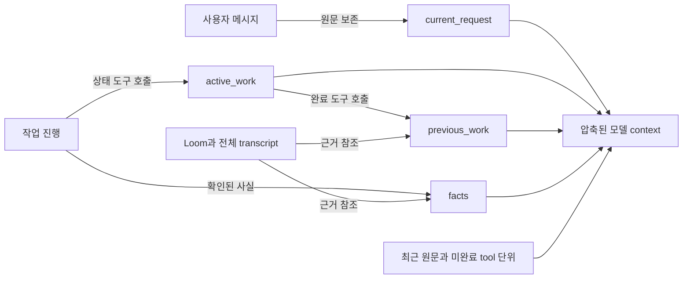

# 장기 실행을 위한 컨텍스트 압축 품질 연구

> 상태: 연구와 구현 제안. 세 memory 도구의 기본 제공은 구현됨;
> 도구 상태만으로 전체 transcript 압축 호출을 대체하는 단계는 미구현
>
> 기준일: 2026-09-27
>
> 범위: Q 메인 루프, 일반 에이전트, 위임 에이전트의 세션 컨텍스트
>
> 현재 동작의 기준 문서: [Context compaction plan](context-compaction-plan.md)

## 결론

Q의 기존 checkpoint 네 필드를 유지하고, 작업 중에 **작은 단위로 갱신하는 도구**를
제공한다. 압축 시에는 이미 유지된 상태를 모델에 투영한다. 전체 오래된 transcript를
별도 압축 요청에 다시 담는 일을 정상 경로에서 없앤다.

| 필드 | 소유자와 의미 | 갱신 시점 |
|---|---|---|
| `current_request` | host가 최신 사용자 요청과 후속 정정, 제약을 원문으로 보존 | 사용자 메시지 수신 시 |
| `active_work` | 아직 해야 할 작은 작업, 진행 중인 작업, 다음 행동 | 작업 분해와 상태 변화 시 |
| `previous_work` | 끝낸 작업과 확인한 결과, 실패 또는 중단한 시도 | 작은 작업 완료 시 |
| `facts` | 작업 중 찾은 사실, 결정, 재사용할 증거 위치 | 사실을 확인하거나 정정할 때 |

압축 뒤 모델이 알 수 있어야 하는 것은 “무슨 작업을 다시 해야 하는가”가 아니라
“무엇이 끝났고 다음에 무엇을 해야 하는가”다. `active_work`와 `previous_work`의
경계를 모델이 별도 요약 시점에 추측하게 두지 않고, 작은 작업이 끝날 때 기록한다.

이 설계의 핵심은 압축용 메모리를 평소의 작업 부산물로 만드는 것이다. 작업 중
일반 모델 턴에서 짧은 상태 갱신 도구를 호출한다. 85%에 도달했을 때
거대한 원본을 읽는 별도 모델 호출을 수행하지 않는다.

## Q의 현재 상태와 수정할 지점

Q는 일반 MCP 및 도구 결과의 원문을 이미 Loom에 저장한다. 모델에는 `loom_ref`,
digest, 크기와 작은 결과 또는 preview가 든 receipt를 반환한다. `get_skill`과 Loom
도구 결과는 별도 정책에 따라 직접 전달한다. 그러므로 **큰 툴 결과의 Loom 외부화는
새 구현 과제가 아니다**. 현재 [`tools/runtime.go`](../tools/runtime.go)의
`CaptureResult`, `CaptureMCPResult`, `encodeLoomReceipt`가 이 경로를 담당한다.

현재 [`memory/manager.go`](../memory/manager.go)는 85% trigger, 22% target, 7%
recent 정책으로 압축 대상을 고른다. 압축 호출에서 `Plan.Source` 전체를 JSON으로
직렬화해 provider에 보낸다. 일반 루프와 서브에이전트가 이 경로를 사용한다.
[`memory/checkpoint.go`](../memory/checkpoint.go)는 네 문자열 배열을 만들고, 새
section이 있으면 그 section을 교체한다. 원본 transcript와 실제 모델 context는
분리되어 있다.

현재 구조의 장점은 네 필드가 간결하고, 실제 사용자 이력은 지우지 않으며,
tool call/result와 task lifecycle을 보호한다는 점이다. 비용과 품질 문제는 **오래된
이력 전체를 압축 순간에 다시 읽고**, 그때 작업의 완료 여부를 재구성하게 하는
부분에 있다.

장시간 Scout trace 한 건에서는 290 model/tool round 동안 `read_file` 213회,
`list_directory` 63회가 실행됐고 저장소 루트 스캔이 최소 8회 반복됐다. `task_start`는
한 번 성공했지만 `task_complete`에는 이르지 못했다. 이 trace는 원인 하나를
증명하지는 않지만, 압축 전후에 “읽은 범위”, “얻은 결론”, “남은 조사”를 명시적으로
남겨야 한다는 평가 fixture로 적합하다.

## 제안: 작업 중 갱신하는 네 필드

### 사용자 요청은 host가 원문으로 보존

`current_request`는 모델 요약 도구로 작성하지 않는다. 사용자의 현재 요청,
후속 정정, 대답으로 확정된 제약을 host가 원문 메시지와 순서로 유지한다. 세션
projection에는 현재 작업에 영향을 주는 원문을 넣는다. 이미지와 같은 비텍스트
content item도 기존 메시지 표현과 참조를 유지한다.

현재 작업과 무관해진 과거 요청을 삭제하는 기준은 새 사용자 요청이나 명시적인
완료 상태다. 모델이 임의로 오래된 제약을 줄이거나 바꾸지 않는다. 원문 자체가
모델 context의 물리적 한도를 넘는 경우에는 조용히 자르지 않고 명시적인 context
오류 또는 사용자 선택이 필요하다.

### 작은 작업의 시작과 완료를 도구로 기록

구현된 도구 계약은 세 가지다.

| 도구 | 입력 | 원자적 결과 |
|---|---|---|
| `memory_set_active_work` | 선택적 `work_id`, `description`, 선택적 `next_action` | 해당 ID의 `active_work` 추가 또는 수정 |
| `memory_complete_work` | `work_id`, `result`, 선택적 `next_work` | active 항목을 `previous_work`로 이동하고 후속 항목을 active에 추가 |
| `memory_record_fact` | 선택적 `fact_id`, `fact`, 선택적 `source` | `facts` 추가 또는 기존 사실 갱신 |

`memory_complete_work`는 active 삭제와 previous 추가가 한 transaction이어야 한다.
두 호출로 나누면 첫 호출 뒤 프로세스가 죽었을 때 작업이 양쪽에서 사라지거나
중복될 수 있다. 현재 도구 결과는 변경된 항목만 간단히 반환하고, 세션의
tool call/result를 재생해 복구한다. 별도 revision과 중복 호출 ID는 후속 과제다.
새 항목의 ID는 host가 발급하고 기존 항목 수정에는 그 ID를 요구한다.
세 도구는 메인 루프와 일반 위임, Scout, Griller, Planner, Coder, Reviewer,
Commit, Thinker 모델 요청에 기본 포함된다. 메인 루프에서 memory 도구만
호출한 것은 실제 작업 도구를 호출해야 한다는 `task_complete` 조건을
충족시키는 행위로 세지 않는다.

예를 들어 파일 구조 조사를 완료했으면 모델은 다음처럼 기록한다.

```json
{
  "tool": "memory_complete_work",
  "arguments": {
    "work_id": "w-12",
    "result": "프로젝트 구조와 실행 경로 확인; 근거: loom://...",
    "next_work": "압축 호출의 입력 범위를 확인"
  }
}
```

결과적으로 `active_work`는 “앞으로 할 일”, `previous_work`는 “한 일”, `facts`는
“확인한 사실”이라는 기존 의미를 유지한다. 진행 중인 항목도 active에 있으므로
중단 복구 시 해당 항목의 마지막 상태와 다음 행동을 알 수 있다.

### `task_complete`와 메모리 갱신은 독립적이다

`memory_complete_work`는 중간 작업과 마지막 작은 작업에 모두 사용할 수 있다.
모델은 작업 중 어느 시점이든 세 memory 도구로 자기 컨텍스트를 갱신한다.
`task_complete`는 기존 task lifecycle의 종료와 구조화된 결과 반환만 담당한다.
host가 그 내용을 추측해 `active_work`나 `previous_work`에 복사하지 않는다.
최종 완료 직전에 마지막 active 항목을 기록할 필요가 있다면
`memory_complete_work`를 먼저 호출한다. `blocked` 결과에서는 이미 수행한
시도를 previous에, 해결되지 않은 일과 blocker를 active에 남길 수 있다.

자식의 `task_complete` 결과는 기존 위임 프로토콜을 따라 부모에게 반환된다.
부모 모델도 별도로 제공받은 memory 도구를 사용해 그중 계속 기억할 작업과
사실을 자기 네 필드에 기록한다. 자식의 전체 memory state를 부모의 네 필드에
자동으로 덮어쓰지 않는다.

현재 Q 구현은 `task_complete` 결과를 반환한 뒤 툴 호출 턴을 닫기 위해
`FinishToolTurn`로 provider에 후속 요청을 한 번 보낸다. 이것은 기존 프로토콜
종료 요청이며, 제안한 memory 갱신을 위한 추가 요약 호출이나 두 번째
`task_complete`가 아니다.

### 네 필드의 저장 형식 유지

provider에 보여 주는 checkpoint는 기존 키 네 개를 유지한다.

```json
{
  "current_request": ["사용자 요청 원문"],
  "active_work": ["w-13: 압축 호출의 입력 범위 확인. 다음: memory/manager.go 검토"],
  "previous_work": ["w-12: 프로젝트 구조와 실행 경로 확인. 근거: loom://..."],
  "facts": ["f-4: 현재 압축 호출은 Plan.Source 전체를 provider에 보낸다"]
}
```

host 내부에서는 항목 ID, revision, 참조와 마지막 갱신 시각을 별도 metadata로 유지할
수 있다. 모델에 보내는 네 배열의 의미와 키를 바꿀 필요는 없다. 기존 checkpoint
parser와 세션은 읽을 수 있어야 하며, ID가 없는 이전 문자열에는 복구 시 host가
임시 ID를 붙인다.

현재 구현에서는 도구 응답에 전체 네 필드가 아니라 변경 항목만 담고, 세션의
tool call/result를 재생해 상태를 복원한다. 기존 압축 응답이 이 상태를 누락해도
host가 갱신한 `active_work`, `previous_work`, `facts`를 checkpoint에 반영한다.
`current_request`를 host 원문에서 직접 만드는 단계와 별도 전체 transcript 압축
호출을 제거하는 단계는 후속 작업이다.

### 사실의 출처와 오래된 사실

`facts`는 툴 출력의 복사본이 아니다. “이 파일이 무엇을 한다”, “이 시도가 왜
실패했다” 같은 재사용할 결론과 원본 참조를 기록한다. 근거를 확인하지 못한
추측은 사실로 넣지 않는다. 파일이 수정돼 근거가 오래되면 기존 사실을 조용히
덮어쓰지 않고 갱신하거나 정정한다.

근거 참조는 가능한 경우 Loom receipt, transcript event, 경로와 코드 범위를
사용한다. Loom ref는 이미 Q가 제공하므로 신규 저장 계층은 필요하지 않다.
ref를 다시 열 수 없는 경우 해당 사실을 재확인 대상으로 표시한다.

## 실제 압축 동작



정상 경로에서는 다음 순서로 진행한다.

1. 모델이 작은 작업을 정할 때 active 항목을 등록한다.
2. 도구 호출 결과에서 확인한 사실을 필요한 경우 기록한다.
3. 작은 작업이 끝나면 한 번의 `memory_complete_work`로 active에서 previous로
   옮긴다. 마지막 작업도 필요하면 같은 도구를 사용한다.
4. host는 모든 갱신을 세션의 durable state로 기록한다.
5. context가 trigger에 도달하면 host가 네 필드와 최근 원문으로 다음 요청을 만든다.
6. 적용에 성공한 뒤에만 provider `conversation_id`를 초기화한다.

압축은 이 경로에서 모델 호출 없이 수행할 수 있다. 기존 full transcript는 세션
기록에 남으며 사용자가 보는 이력도 유지된다. 오래된 memory 도구 호출과 결과는
새 모델 context에서 제거할 수 있다. 현재 미완료 tool call/result, `task_start`,
`ask_to_user`의 필요한 교환과 최근 원문은 계속 보존한다.

### 기록하지 않은 구간 처리

모델이 memory 도구를 호출하지 않았는데 오래된 대화를 삭제하면 정보가 소실된다.
host는 마지막 확인된 memory revision 이후의 **미기록 구간**을 추적해야 한다.

- 평소에는 작은 작업 완료 시 갱신을 요청하는 짧은 reminder를 줄 수 있다.
- context가 한도에 접근하면 먼저 모델에 현재 미기록 구간을 상태 도구로 기록하게
  한다. 이미 진행 중인 일반 모델 요청을 활용하고 별도 전체 transcript 압축 호출은
  만들지 않는다.
- 그 구간이 한 번에 다루기 어려울 만큼 길면 작은 event 범위로 나눠 갱신한다.
- coverage가 확인되지 않은 event를 host가 임의로 버리지 않는다.
- 상태 갱신을 끝내지 못하면 기존 compaction 경로를 복구용 fallback으로 사용하되,
  가능한 최근 미기록 범위만 전달한다. 오래된 네 필드까지 원문으로 다시 보내지 않는다.

이를 위해 도구 호출이 다룬 `covered_through_event`를 저장한다. host는 그 지점까지
미완료 tool 단위가 없는지와 참조한 event가 실제 존재하는지 검증한다. 중요한
의미가 모두 기록됐는지는 구조 검사만으로 증명할 수 없으므로 replay 평가로
확인한다. 모델이 갱신을 시도한 뒤 실패하면 범위 경계를 올리지 않는다.

### 작업을 기록하는 도구 자체의 비용

memory 도구 정의와 호출도 토큰을 쓴다. 매 파일 읽기마다 `facts`를 쓰거나 매
툴 호출을 `previous_work`로 옮기면 효과가 줄어든다. 갱신 단위는 **독립적으로
완료 여부를 판단할 수 있는 작은 작업**이다. `facts`는 나중에 작업 결정에
영향을 주는 사실에만 사용한다. host는 중복 사실, 너무 긴 항목, 존재하지 않는
work ID와 깨진 Loom ref를 거절하거나 수정 요청을 반환한다.

세션이 매우 길어져 `previous_work`와 `facts` 자체가 커질 수 있다. 이때도 전체
transcript를 다시 보내지 않는다. 끝난 작업의 상세 기록은 session archive에
두고, 현재 요청과 직접 관련이 적은 **일부 완료 항목**만 작은 묶음으로 정리해
네 필드의 크기를 제한한다. 이 보조 정리에는 항목 ID와 원본 위치를 남긴다.

## 상태의 저장과 복구

memory 도구는 모델 출력만 남기지 않고 host의 세션 상태도 변경해야 한다. 순서는
도구 호출 기록 → 유효성 검사 → 상태 저장 → 성공 결과 기록이다. 성공 결과를
모델에 보냈는데 상태가 저장되지 않은 경우를 만들지 않아야 한다.

- 각 수정에 `revision`과 `operation_id`를 부여해 재시도해도 한 번만 적용한다.
- 중단 뒤 재개할 때 마지막 확정 revision과 transcript를 함께 읽는다.
- 실행 여부를 확인할 수 없는 memory 도구 호출은 성공으로 추정하지 않는다.
- 작업을 완료로 옮길 때 다음 작업까지 하나의 원자적 수정으로 저장한다.
- 위임 자식은 자기 세션의 네 필드를 유지하고, 부모에게 돌아올 때 결과와 필요한
  사실만 부모의 `previous_work`/`facts`에 반영한다.
- 동시 자식은 서로 다른 ID와 revision으로 기록하고, 도착 순서에 따라 부모 상태를
  덮어쓰지 않는다.

기존 `GeneralRunState.Started`, execution checkpoint와 lifecycle archive는 각자의
실행 상태를 계속 담당한다. 네 필드는 모델이 작업을 이어갈 수 있도록 보여 주는
기억이다. `task_complete` 여부 같은 프로토콜 진실은 기존 host 상태에서 확인한다.

## 하네스 비교

공개 구현과 공식 문서를 기준으로, Q의 작은 상태 갱신 방식에 도움이 되는 점을
비교했다. 아래의 장단점은 Q 적용에 대한 판단이다.

| 하네스 | 관찰한 방식 | 장점 | Q에 적용할 때의 한계 |
|---|---|---|---|
| OpenAI Codex CLI | Memento 압축, 최근 사용자 메시지와 요약 보존, canonical initial context 재삽입 | 사용자 의도와 초기 계약을 강하게 유지한다. | 요약 생성은 여전히 압축 시점 작업이며 Q의 여러 provider용 durable state를 대신하지 않는다. |
| OpenAI Agents SDK | Responses 세션에 `responses.compact` 적용, transaction과 generation guard | provider가 지원할 때 구현이 단순하고 실패 복구가 분명하다. | provider가 만든 compact item만으로 Chat Completions나 다른 provider로 이전하기 어렵다. |
| Claude | compaction, 오래된 tool/thinking 제거, 외부 memory 검색 | 요약, pruning, 외부 기억을 분리한다. | Anthropic 전용 기능과 Q의 task lifecycle을 연결해야 한다. |
| Gemini CLI | 큰 함수 응답 외부화, structured snapshot과 두 번째 누락 검증 | 요약 검증과 커지면 거부하는 안전장치가 좋다. | 큰 history를 요약하는 호출 자체는 남는다. Q는 평소 memory 도구로 이 비용을 분산할 수 있다. |
| Qwen Code | 작업·파일·오류·next step을 나눈 snapshot, microcompaction과 hook | 개발 작업의 완료 상태를 잘 드러낸다. | 구간 전체를 다시 쓸 때의 손실은 별도 관리가 필요하다. |
| OpenHands SDK | append-only event log와 별도 condenser view | 원본과 모델 view를 분리하고 복구하기 쉽다. | 필요한 작업 상태를 언제 기록할지는 별도 정책이 필요하다. |
| Aider | 앞부분 재귀 요약, 뒤쪽 원문 유지 | 단순하고 비용이 낮다. | 반복 요약에서 완료 여부와 세부 근거가 흐려질 수 있다. |

Q는 이미 원본 transcript와 Loom을 갖고 있다. 가장 큰 개선 여지는 다른 저장소
도입이나 더 긴 요약 prompt보다 **완료 시점에 작업 상태를 바로 갱신하는 계약**이다.

## 논문에서 얻는 원칙

- [Lost in the Middle](https://arxiv.org/abs/2307.03172)는 정보가 긴 입력의 중간에
  있을 때 회수 품질이 낮아질 수 있음을 보였다. 관련 상태를 작은 projection에
  배치할 근거다.
- [RULER](https://arxiv.org/abs/2404.06654)는 단순 needle retrieval 점수만으로
  다중 단서와 긴 작업의 성능을 판단하기 어렵다는 점을 보여 준다.
- [MemGPT](https://arxiv.org/abs/2310.08560)는 작은 활성 context와 외부 저장소의
  계층적 사용을 제안했다. Q의 transcript와 Loom이 이 외부 계층이다.
- [LongLLMLingua](https://aclanthology.org/2024.acl-long.91/)의 token 압축은
  검색 문서에는 유용할 수 있으나, 정확한 코드 경로와 도구 상태의 주 기억 형식으로
  쓰기에는 정보 손실 위험이 크다.
- [ReSum](https://arxiv.org/abs/2509.13313)은 주기적인 reasoning state 압축의
  효과와 압축된 상태에 맞춘 continuation의 중요성을 보고한다.
- [ACE](https://arxiv.org/abs/2510.04618)는 반복해서 전체 memory를 짧게
  rewrite할 때 세부 정보가 무너질 수 있다고 분석한다. 항목별 증분 갱신을
  선호할 이유다.
- [Context-Folding](https://arxiv.org/abs/2510.11967)과
  [AgentFold](https://openreview.net/pdf/9a7a36e880bf0debe14bf234275484321e7b0d64.pdf)는
  완료된 subtask를 경계에서 접는 접근을 연구한다. Q에서는 작은 작업 완료 도구와
  위임 결과 반영이 그 경계가 된다.

논문들의 성능 수치는 연구 대상 작업의 결과다. Q에 그대로 일반화하지 않고 Q의
실제 trace로 검증한다.

## Chat Completions, Responses와 prompt cache

host가 보유한 네 필드와 원본 transcript는 API mode에 독립적이다. Chat Completions는
이 상태를 message로, Responses는 input item으로 변환한다. provider native
compaction을 쓸 수 있어도 Q 세션의 복구용 네 필드는 유지한다.

평소 모델 context는 append-only로 둔다. memory 도구 호출과 결과가 뒤에 추가되고,
이전 provider 메시지를 매 round 다시 쓰지 않는다. 압축 시점에만 안정적인
system/tool prefix 뒤에 현재 요청, 네 필드 projection과 최근 원문을 배치한다.
따라서 갱신 도구를 쓴다는 이유로 매 라운드 prompt prefix cache가 깨질 필요는
없다. 초기 구현에서는 기존 85% trigger, 22% target, 7% recent 정책을 유지하고
상태 보존과 비용을 먼저 비교한다. 압축 직후에는 prefix가 바뀌므로 실제 cache
hit와 비용을 측정해야 한다.

## 평가 계획

### 현재 trace에서 비교할 것

같은 transcript의 여러 cut point에서 현재 압축과 증분 갱신 방식을 비교한다.

| 항목 | 관찰 방법 |
|---|---|
| 추가 압축 입력 토큰 | 압축만을 위해 provider에 보낸 token 수 |
| 상태 보존 | 사용자 제약, active 작업, 완료 작업, 사실과 출처를 재생 후 확인 |
| 다음 행동 | 압축 전 원본을 보는 실행과 다음 tool/args 비교 |
| 중복 작업 | 동일 파일·범위·digest의 재읽기와 루트 재스캔 횟수 |
| 완료율 | 같은 라운드 및 비용 한도 안에서 `task_complete` 도달 비율 |
| 복구 정확성 | 충돌, 중단, 동시 위임 뒤 work ID와 revision 일관성 |
| cache 영향 | provider별 input/cached token과 재구성 횟수 |

특히 290-round Scout 사례에서는 압축 뒤 같은 digest를 다시 읽는 횟수와 최종
완료 여부를 측정한다. “요약이 짧다”는 자체로 합격 조건이 아니다.

### 필수 edge case

- 작은 작업을 시작한 뒤 도구 실행 중 중단
- 완료 도구 호출 직후, 성공 결과 저장 전 중단
- 동일 `operation_id`를 재전송
- active ID 없이 완료 요청
- 새 사용자 정정이 과거 요청과 충돌
- 사실의 출처 파일이 수정됨
- `get_skill`처럼 원문 보존 정책이 다른 결과
- 미완료 tool call을 포함한 압축
- 기록하지 않은 구간이 recent 예산을 초과
- root → planner → executor → coder 중첩 위임과 동시 자식 완료
- Chat Completions ↔ Responses 및 provider 전환
- 기존 네 배열 checkpoint를 가진 세션 재개

초기 합격 조건은 active user constraint와 미완료 작업을 모두 보존하고,
잘못 완료된 lifecycle과 사라진 작업 ID가 0건이며, 현재 방식보다 추가 압축
입력 토큰과 압축 후 재조사 횟수가 줄어드는 것이다.

## 구현 순서

1. 네 필드를 유지한 durable memory state와 `revision`/`operation_id`를 추가한다.
2. 세 갱신 도구를 메인 루프와 일반 위임 에이전트에 제공한다.
3. 작은 작업 완료 시 atomic 이동과 다음 작업 등록을 구현한다.
4. 압축 전에 미기록 구간을 검사하고, 네 필드 + 최근 원문으로 projection한다.
5. 현재 구현의 전체 transcript 요약 호출을 별도 단계에서 교체한다. 세 memory
   도구를 제공한 것만으로 이 호출이 제거되지는 않는다.
6. 장시간 Scout trace, 중첩 위임, API 전환으로 품질과 비용을 비교한다.

처음부터 네 필드의 의미를 바꾸거나 큰 v2 schema를 도입할 필요는 없다. 도구 기반
갱신과 원자적 저장만으로도 현재 방식의 가장 비싼 압축 호출을 줄일 수 있는지
검증할 수 있다. 그 결과 부족한 정보가 무엇인지 확인한 뒤 필드를 늘리는 편이 낫다.

## 참고 구현

- [OpenAI Codex compaction](https://github.com/openai/codex/blob/main/codex-rs/core/src/compact.rs)
- [OpenAI Agents SDK sessions](https://openai.github.io/openai-agents-python/sessions/)
- [OpenAI Agents SDK models](https://openai.github.io/openai-agents-python/models/)
- [Anthropic compaction](https://platform.claude.com/docs/en/build-with-claude/compaction)
- [Anthropic context editing](https://platform.claude.com/docs/en/build-with-claude/context-editing)
- [Anthropic memory tool](https://platform.claude.com/docs/en/agents-and-tools/tool-use/memory-tool)
- [Anthropic context engineering](https://www.anthropic.com/engineering/effective-context-engineering-for-ai-agents)
- [Gemini CLI chat compression](https://github.com/google-gemini/gemini-cli/blob/main/packages/core/src/context/chatCompressionService.ts)
- [Qwen Code compression prompt](https://github.com/QwenLM/qwen-code/blob/main/packages/core/src/core/prompts.ts)
- [Qwen Code client compaction path](https://github.com/QwenLM/qwen-code/blob/main/packages/core/src/core/client.ts)
- [OpenHands condenser](https://github.com/OpenHands/software-agent-sdk/blob/main/openhands-sdk/openhands/sdk/context/condenser/base.py)
- [Aider history summarizer](https://github.com/Aider-AI/aider/blob/main/aider/history.py)
