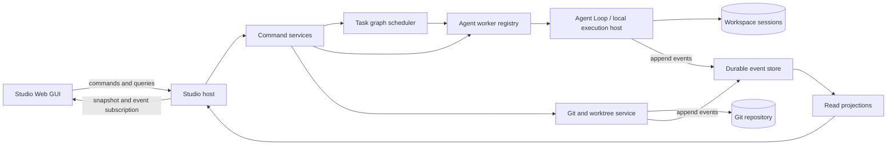

# Q Studio blueprint

작성일: 2026-09-28

상태: 활성 청사진. 이 문서는 Q Studio의 목표 구조, 현재 기반과 선행 작업 순서를
정의한다. 현재 동작의 세부 계약은 각 링크된 구현 문서와 코드가 소유한다.

현재 구현: user-level `q studio` loopback server와 embedded Svelte shell이 존재한다.
전역 Settings는 Gateway provider, discovery 기반 model·role assignment,
System One provider·decision model routing·server API key lifecycle,
runtime/context/Loom과 Gateway·System One listener를 기존 store의
검증·원자적 저장 계약으로 편집하며 MCP/LSP 현황을 조회한다. workspace model
override는 아직 TUI가 소유한다. Sessions 화면은 사용자가 입력한 canonical repository
root에서 기존 session을 조회하거나 새 session을 만들고, transcript를 복원해 공통
default loop에 메시지를 보낸다. 응답, reasoning, tool call과 agent activity는 요청 중
NDJSON으로 표시한다. 질문 응답, durable event 재연결, session 삭제와 명시적인 turn
중단 command는 아직 이전되지 않았다.

대상 독자: Q의 TUI, agent runtime, workspace session, Git 작업 흐름과
웹 인터페이스를 설계하거나 구현하는 사람.

갱신 조건: Studio의 제품 범위, 런타임 경계, 권위 데이터, TUI 이전 범위, Git/MR
모델, 작업 그래프 또는 주요 마일스톤 순서가 달라질 때 갱신한다. 구체적인 API와
저장 schema는 구현 마일스톤의 별도 계약이 소유하며 이 문서에는 경계만 유지한다.

## 1. 방향

Q Studio는 여러 agent가 수행하는 장기 작업을 한곳에서 시작하고 관찰하고 개입하는
로컬 제어면이다. 사용자는 브라우저에서 대화와 설정을 관리하고, agent 호출 트리와
작업 그래프를 따라가며, 각 agent의 로그·도구 호출·코드 변경·리뷰 상태를 확인한다.

`q studio`가 사용자 단위 웹 애플리케이션과 제어 서버를 함께 시작하는 진입점이
된다. Studio process는 실행한 디렉터리를 workspace로 소유하지 않는다. 메인 Agent
Loop는 저장소 경로, 기준 commit, subagent와 요청을 담은 위임 작업을 로컬 실행
호스트에 보낸다. 실행 호스트는 해당 저장소에 격리 worktree를 만들고 공통 Agent
Loop를 실행한 뒤 Change Request를 요청한 부모에게 돌려준다. Studio는 이 흐름을
관찰하고 개입하는 제어면이며, 실행 요청을 받는 별도 HTTP execution API는 두지 않는다.

### Workspace와 session 소유권

- 각 session이 하나의 canonical `workspace_root`를 소유한다.
- 새 session을 만들 때 working directory를 선택하며, 기존 session을 열면 저장된
  workspace가 함께 복원된다.
- run은 session의 workspace를 상속한다. task와 change는 자신을 만든 session 및
  repository 관계를 명시적으로 기록한다.
- Studio는 서로 다른 workspace에 속한 session과 run을 한 process에서 동시에
  조회하고 실행할 수 있다.
- Studio를 어느 디렉터리에서 시작했는지는 session, run, task 또는 Git 작업의
  workspace를 결정하지 않는다.
- 최근에 열었던 workspace catalog는 session 발견을 위한 사용자 단위 projection이다.
  source tree와 workspace별 Q 데이터의 권위는 각 canonical root에 남는다.

### 실행 경로 분리

일반 session에서는 아래 세 경로가 같지만, 다른 repository에 위임하거나 Git
worktree를 lease하면 서로 달라진다. 실행 계약은 하나의 `workspace root`로 이 셋을
대신하지 않는다.

| 경로 | 소유 데이터와 동작 |
| --- | --- |
| Session Store | 요청한 부모 session의 transcript, child session, delegation bookmark와 실행 checkpoint |
| Workspace State Root | 대상 repository의 `.q` 설정, q-managed skill, Loom, archive/index와 Change Request metadata |
| Checkout Root | agent에게 노출되는 source tree, file/shell/Git 도구, portable `.agents/skills`, `AGENTS.md`와 LSP process |

부모 session이 repository A에서 repository B의 작업을 위임하면 child 대화와 호출
관계는 A의 부모 Session Store 아래에 남고, B의 durable workspace 상태는 B의 canonical
root를 사용한다. 실제 수정만 별도 worktree인 Checkout Root에서 수행한다. delegation
state는 대상 repository identity, change ID와 checkout lease를 연결한다.

worktree 안에 `.q`를 복사하거나 symlink하지 않는다. runtime은 checkout에서
`.agents/skills`와 source instruction을 읽되 `.q/skills`와 Loom은 Workspace State
Root에서 연다. checkout 정리는 session, review와 workspace archive를 삭제하지 않는다.

### Frontend와 배포

- Studio frontend는 `studio/frontend`의 Svelte SPA이며 Vite로 build한다.
- production output인 `studio/frontend/dist`를 Git에 포함한다.
- Go의 `studio` package는 `//go:embed all:frontend/dist`로 output을 binary에 넣는다.
  따라서 module proxy에서 받는 `go install ...@latest`는 Node 없이 같은 UI를 만든다.
- frontend dependency는 lockfile로 고정하고, frontend를 변경할 때 source와 생성된
  `dist`를 같은 commit에 넣는다.
- CI와 release check는 `npm ci`, type check와 production build를 실행한 뒤 versioned
  `dist`에 diff가 없는지 확인한다.
- Studio는 UI와 API를 같은 origin에서 제공한다. `/api/`는 fallback 대상이 아니며,
  존재하지 않는 asset도 SPA HTML로 바꾸지 않는다. Browser route만 `index.html`로
  fallback한다.
- hashed asset은 장기 cache하고 `index.html`과 status API는 다시 검증하거나
  cache하지 않는다. production sourcemap은 기본 output에 포함하지 않는다.
- 개발 중에는 `q studio --port 7070 --no-open`과 Vite dev server를 함께 실행하고,
  Vite가 `/api`를 Studio server로 proxy한다.

전달 순서는 다음과 같다.

1. 기존 TUI의 기능을 presentation-neutral application service로 분리한다.
2. Studio Web GUI에 세션·채팅·질문·중단·변경 검토·설정 기능을 옮긴다.
3. 모든 agent 실행을 지속 가능한 event와 run registry로 기록하고 호출 트리를
   표시한다.
4. 실행 중 메시지 전달, 질문 응답, 일시 정지와 취소 같은 개입을 추가한다.
5. 작업별 Git branch와 worktree, 내부 merge request와 리뷰 흐름을 추가한다.
6. 역할형 agent가 의존성 그래프에 따라 장기 작업을 이어가는 scheduler를 추가한다.

Web GUI 이전은 Git/MR 기능의 선행 작업이다. 다만 초기 UI와 event 계약은 처음부터
코드 변경, 리뷰, 병렬 agent와 장기 작업을 표현할 수 있게 설계한다.

## 2. 원하는 결과

- 브라우저에서 현재 TUI가 제공하는 일상 기능을 사용할 수 있다.
- 서로 다른 workspace의 session과 agent run을 한 Studio에서 동시에 관찰할 수 있다.
- 호출 관계는 tree로, 작업 의존성과 병합 관계는 graph로 볼 수 있다.
- 실행 중인 agent가 무엇을 읽고 수정하고 호출하는지 실시간으로 확인할 수 있다.
- 사용자가 agent에 추가 지시를 보내거나 질문에 답하고, 실행을 중단·재개할 수 있다.
- 개발 작업은 agent별 branch와 worktree에서 격리되고 merge request로 인계된다.
- manager와 senior developer가 작업을 할당하고 리뷰하며, junior developer가 수정 후
  다시 제출하는 반복이 durable state로 남는다.
- Studio 또는 worker가 종료되어도 완료된 커밋과 기록을 잃지 않고 이어갈 수 있다.

초기 범위는 한 사용자가 소유한 로컬 Studio다. 다중 사용자 SaaS, 범용 Git forge,
GitHub/GitLab 호환 API, 임의 조직의 권한 모델은 초기 목표에 포함하지 않는다.

## 3. 현재 기준선

현재 구현에서 재사용할 수 있는 경계는 다음과 같다.

- TUI와 ACP는 같은 Agent Loop와 workspace tool runtime을 사용한다.
- workspace session은 transcript, active task와 학습 상태를 `.q/sessions` 아래에
  저장하고 session lock으로 동시 소유를 막는다.
- 중첩 delegation은 `task_id`와 `parent_id`를 전파하고 자식 session tree와 복구
  bookmark를 저장한다.
- agent event에는 message, tool call/result, status, activity, trace, question과 final
  result가 이미 존재한다.
- `/changes`는 staged, unstaged와 untracked 변경을 읽기 전용으로 보여준다.
- 설정 화면은 model/provider, Gateway, System One, Library, Loom, Skills, LSP, MCP,
  subagent와 `.qignore`를 관리한다.
- `q studio`는 시작 CWD와 무관한 global shell, embedded frontend, service status와
  global Settings를 제공한다. Sessions 화면은 repository root를 명시적으로 받아
  `.q/sessions`의 목록·생성·transcript 복원과 default loop 실행을 제공한다. 실행은
  기존 Bubble Tea model을 renderer 없이 구동하므로 TUI와 같은 tool runtime, 저장,
  compaction과 delegation 경로를 사용한다.

현재 위임은 같은 workspace 안의 child session과 Agent Loop 실행까지 제공한다.
repository를 지정하는 위임, worktree lease, Change Request, 재연결 가능한 run event와
장기 scheduler는 아직 제공하지 않는다. 위임 복구는 [중첩 delegate 세션과 재귀
복구](delegation-session-recovery.md), 저장 방향은 [Session Store](session-store-notes.md)가
소유한다.

도구 runtime과 delegation 실행 문맥은 Workspace State Root와 Checkout Root를 분리할
수 있다. 일반 TUI·ACP는 현재 같은 canonical root를 양쪽에 전달한다. repository 지정
위임이 이 계약에 worktree lease를 연결하는 단계는 아직 구현되지 않았다.

현재 `web/`은 Eleventy 기반 공개 문서 사이트다. Studio application과 문서 사이트는
서로 다른 source와 build artifact를 사용한다.

## 4. 사용자 흐름

### 일상 대화와 설정

1. 사용자가 `q studio`를 실행한다. 시작 디렉터리는 Studio scope를 제한하지 않는다.
2. 출력된 local URL을 브라우저에서 연다.
3. workspace와 함께 표시되는 기존 session을 선택하거나 working directory를 골라
   새 session을 만들고 메시지를 보낸다.
4. reasoning, 응답, tool call과 하위 agent 활동이 순서대로 갱신된다.
5. agent가 질문하면 사용자가 같은 화면에서 답하고 실행을 이어간다.
6. 모델, provider, skill과 연결 설정을 별도 설정 화면에서 관리한다.

### 위임된 코드 작업

1. manager 또는 senior developer가 저장소 경로, 기준 commit, subagent와 요청을 담아
   위임한다.
2. 로컬 Git 실행 호스트가 저장소를 검증하고 기준 commit에서 branch와 worktree를
   만들어 해당 subagent에 lease한다.
3. junior developer가 worktree에서 수정하고 검사한 뒤 커밋을 제출한다.
4. 실행 호스트가 기준 commit과 head commit을 고정한 Change Request를 요청한 부모
   session에 반환한다.
5. 요청한 agent 또는 senior developer가 diff와 검사 결과를 검토하고 승인하거나
   수정 요청을 같은 child 작업에 돌려준다.
6. 수정 요청과 재제출은 같은 Change Request의 iteration으로 기록된다.
7. 요청한 쪽이 승인하면 대상 branch에 병합하고 worktree lease를 해제한 뒤 결과를
   상위 작업에 반영한다.

### 관찰과 개입

1. 사용자가 Studio의 실행 화면에서 호출 tree 또는 task graph를 연다.
2. node를 선택해 입력, 모델, 상태, transcript, tool call, 변경 파일과 비용을 본다.
3. 추가 지시, 질문 응답, 일시 정지, 취소, 재실행 또는 담당 변경을 요청한다.
4. 명령은 durable command로 기록되고 agent의 안전한 경계에서 적용된다.
5. 적용 여부와 후속 상태가 같은 node의 timeline에 남는다.

## 5. Web GUI 정보 구조

Studio의 첫 navigation은 `Overview`, `Sessions`, `Settings`로 제한한다. agent 실행과
Git 작업 화면은 실제 workflow가 정해질 때 navigation을 확장하며, 데이터 모델의
이름을 곧바로 최상위 메뉴로 노출하지 않는다.

장기적으로 다뤄야 할 정보 영역은 다음과 같다.

| 영역 | 제공할 정보와 동작 |
| --- | --- |
| Workspaces | session에서 발견하거나 사용자가 연 canonical root, repository와 상태 요약 |
| Sessions | workspace가 표시된 session 목록, 생성·이름 변경·삭제, transcript와 active task |
| Chat | composer, streaming message/reasoning, tool result, 질문과 실행 중단 |
| Agent activity | 호출 tree, 선택한 run의 timeline, 자식 호출과 runtime 상태 |
| Work graph | 의존성 graph, 담당 역할, checkpoint, 차단 원인과 우선순위 |
| Changes | worktree, branch, commit, 변경 파일, diff, review와 merge 상태 |
| Settings | model/provider, service, skill, LSP, MCP, subagent와 workspace 설정 |
| Operations | worker health, lease, 복구, 로그, 사용량과 보존 상태 |

호출 tree와 작업 graph는 같은 데이터를 다른 방식으로 투영한다. `parent_run_id`는
누가 누구를 호출했는지 표현하고, task edge는 선행 작업, 병렬 작업과 여러 결과의
병합 관계를 표현한다. 저장 모델을 tree로 제한하지 않는다.

## 6. TUI 기능 이전 범위

Web GUI가 아래 기능의 실제 소유 화면이 된 뒤에 해당 TUI 화면의 축소나 제거를
판단한다. 이전 기간에는 두 UI가 같은 application service와 계약을 사용한다. 화면별
파일 I/O나 agent 실행 로직을 frontend에 복제하지 않는다.

| 기능군 | 현재 TUI 기능 | Web GUI 완료 조건 | 순서 |
| --- | --- | --- | --- |
| App shell | workspace 표시, help, 상태와 오류 | 전역 Studio 상태, navigation, 선택 session의 workspace context와 오류 복구 | 선행 |
| Sessions | 목록, 새 session, 전환, 삭제, 복구 | 목록과 lifecycle 전체, 새로고침 후 같은 선택과 상태 복원 | 선행 |
| Chat | 입력, streaming, Markdown, reasoning, tool body 접기 | 메시지 순서와 진행 상태를 보존하고 실행 중 재연결 가능 | 선행 |
| Interaction | `ask_to_user`, turn interrupt | 질문 응답과 취소가 정확한 run/tool call에 전달됨 | 선행 |
| Delegation | 자식 activity와 상세 trace | 호출 tree와 자식 timeline에서 같은 실행을 추적 | 선행 |
| Changes | staged/unstaged/untracked diff | 파일·상태별 diff, binary/large-file 제한과 reload | 선행 |
| Commit | commit 제안, 분할 검토와 실행 | 제안 수정, 선택, 실행 결과와 실패 복구 | 2차 |
| Models | role assignment, reasoning, embedding, fallback group | global/workspace scope와 discovery를 포함한 편집 | 2차 |
| Providers | setup과 managed provider | credential을 노출하지 않는 provider 관리 | 2차 |
| Gateway | provider, listener와 API key | 자동 저장, key 일회 표시와 revoke | 2차 |
| System One | provider, role model, listener와 API key | 여러 provider/model 선택과 key lifecycle | 2차 |
| Library/Loom | listener와 보존·GC 설정 | 상태, 설정, GC 실행과 결과 확인 | 2차 |
| Skills | global/workspace 목록과 관리 | scope별 추가·삭제·재색인 상태 | 2차 |
| LSP | server와 root 설정 | global/workspace 설정, discovery와 오류 표시 | 2차 |
| MCP | connection과 role assignment | 연결 편집, 상태 검사와 role assignment | 2차 |
| Subagents | builtin/custom profile과 ACP binding | profile, delegation grant, probe와 binding 관리 | 2차 |
| Ignore | `.qignore` 편집 | 검증, 저장과 충돌 감지 | 2차 |
| Usage/Help | 사용량 dashboard와 key reference | Studio navigation에 맞춘 usage와 도움말 | 2차 |

TUI shortcut의 문자 그대로의 복제는 완료 조건이 아니다. 각 기능의 상태 전이,
오류 처리, 자동 저장, secret 취급과 취소 의미가 Web GUI에서 보존되어야 한다.

## 7. 목표 runtime 구조



### Studio host

- `q studio`의 process lifecycle과 browser asset 제공을 소유한다.
- 사용자 단위 workspace catalog, session별 workspace admission, browser session과
  local authentication을 관리한다.
- command API, query API와 cursor 기반 event subscription을 제공한다.
- agent worker, task scheduler와 Git service의 상태를 조정한다.
- 종료 시 새 작업을 막고 활성 command와 lease를 복구 가능한 상태로 정리한다.

### Application services

- session, configuration, changes, commit과 agent lifecycle을 UI와 분리해 제공한다.
- TUI와 Studio가 전환 기간 동안 같은 validation과 저장 규칙을 사용하게 한다.
- 반환 값은 Bubble Tea model이나 HTML이 아닌 transport-neutral command/result다.

### Agent worker

- 하나 이상의 agent run을 실행하고 event와 heartbeat를 Studio에 전달한다.
- 로컬 첫 버전은 공통 Agent Loop를 호출하는 in-process execution host를 사용한다.
- 위임 command는 canonical repository root, base commit, subagent ID, prompt와 부모
  run/session ID를 포함하며 execution host가 worktree 생성부터 Change Request 제출까지
  책임진다.
- 별도 머신의 worker가 필요해지면 같은 run/command 계약을 network transport에
  투영한다.
- worker가 authoritative task나 MR 상태를 직접 소유하지 않는다.

### Git and worktree service

- repository 등록, ref 조회, branch와 worktree 생성, lease와 정리를 소유한다.
- commit graph, diff, checks, merge request와 review 명령을 제공한다.
- Git object와 ref는 실제 repository가 권위 데이터이고, Q는 작업·리뷰 metadata와
  projection을 소유한다.

## 8. 권위 데이터와 projection

| 데이터 | 권위 원본 | 재생성 가능한 projection |
| --- | --- | --- |
| Workspace 관계 | session의 canonical root와 Studio의 최근 root catalog | workspace 목록과 상태 요약 |
| 대화와 agent context | workspace session과 child session | Web transcript, 검색 index |
| Run lifecycle | append-only Studio event log | 호출 tree, timeline, 상태 요약 |
| Task와 dependency | Studio task store | graph layout, 역할별 queue |
| Source와 commit | Git object database와 refs | 파일 목록, diff cache, 통계 |
| Worktree 할당 | Studio lease store와 실제 Git worktree | worker별 작업 화면 |
| Merge request/review | Studio change store + 고정된 base/head commit | review inbox, badge와 dashboard |
| 설정과 secret metadata | 기존 Q config store와 keyring | 설정 form과 health 상태 |

UI projection은 권위 원본을 수정하지 않는다. 모든 변경은 command service를 거치며,
성공한 command는 event와 새 revision을 남긴다. 여러 browser tab이나 worker에서 같은
대상을 수정할 때 expected revision 또는 idempotency key로 중복과 덮어쓰기를 막는다.

## 9. Run, task와 change 모델

### Run

한 번의 agent 실행이다. 최소 식별 관계는 `run_id`, `parent_run_id`, `session_id`,
`task_id`, agent/profile ID, role과 worker ID다.

```text
queued → starting → running → waiting_for_input → running
                            ↘ succeeded | blocked | failed | canceled | lost
```

`lost`는 heartbeat가 끊기고 실행 결과를 확인할 수 없는 상태다. session과 Git의
durable evidence를 검사하기 전에는 자동으로 성공이나 실패로 바꾸지 않는다.

### Task

사용자 결과를 향한 장기 작업 단위다. Task는 여러 run과 change를 가질 수 있고 다른
task에 의존할 수 있다.

```text
backlog → ready → active → in_review → approved → merging → completed
                    ↑          ↓
                    └─ changes_requested

active → blocked | failed | canceled
```

호출 tree의 node와 task graph의 node는 일대일일 필요가 없다. 하나의 task를 여러
agent run이 이어받을 수 있고, 한 manager run이 여러 task를 만들 수 있다.

### Change와 merge request

Change는 repository, base ref, base commit, head ref, head commit과 worktree lease를
연결한다. Merge request는 Change의 review projection이다.

```text
draft → open → changes_requested → open → approved → merging → merged
                 ↘ conflicted                  ↘ failed
draft/open → closed
```

리뷰 결과는 head commit에 귀속한다. 새 commit이 제출되면 이전 approval을 유지할지
무효화할지는 merge policy가 결정하며 기본 정책은 구현 마일스톤에서 확정한다.

## 10. Event와 재연결 계약

Studio Web GUI는 실행 요청의 연결 수명에 종속된 일회성 stream만으로 동작하지 않는다.
event는 먼저 durable log에 append되고 UI는 snapshot 뒤 cursor부터 이어받는다.

공통 envelope에 필요한 의미는 다음과 같다.

- 전역 또는 workspace 안에서 정렬 가능한 `event_id`와 sequence
- canonical workspace identity, `session_id`, `run_id`, `parent_run_id`, `task_id`
- event kind, 발생 시각, producer와 schema version
- tool call, question, change 또는 review를 가리키는 대상 ID
- redaction된 payload와 큰 결과의 Loom reference

Browser reconnect는 마지막 확인 cursor 이후 event를 다시 받아 projection을
복구한다. 중복 event를 받아도 같은 화면 상태가 되어야 한다. command 응답과 event
사이의 경쟁을 피하기 위해 command ID와 결과 event를 연결한다.

기존 workspace의 delegation bookmark와 session은 migration 없이 읽을 수 있어야
한다. Studio용 event가 없는 과거 session은 transcript와 저장된 child tree에서 초기
projection을 만들고, 이후 발생한 event만 append한다.

## 11. 사용자 개입 계약

개입은 worker process의 임의 메모리를 직접 바꾸는 대신 기록 가능한 command로
처리한다.

- **Send guidance**: 현재 목표를 바꾸지 않는 추가 지시를 agent의 다음 model 경계에
  전달한다.
- **Answer question**: 정확한 run ID와 tool call ID에 답을 연결한다.
- **Pause**: 새 model/tool 작업 진입을 막고 현재 취소 가능한 경계까지 진행한다.
- **Resume**: 저장된 context와 최신 지시로 같은 run 또는 successor run을 시작한다.
- **Cancel**: context cancellation을 전달하고 완료되지 않은 tool과 lease를 정리한다.
- **Reassign**: task의 담당 agent/profile, role 또는 model을 바꾸고 새 run으로 이어간다.
- **Request review**: 현재 head commit으로 merge request를 열거나 갱신한다.

각 command는 요청자, 시각, 대상, 입력, 수락 여부와 결과를 audit event로 남긴다.
이미 끝난 run에 도착한 command는 조용히 유실하지 않고 거절 또는 successor run
생성으로 명확하게 끝낸다.

## 12. Git 작업 격리와 리뷰

첫 Git 구현은 Q가 접근 가능한 기존 local repository를 사용한다. Studio가 Git
protocol server까지 제공해야 하는 시점은 다른 머신의 worker가 repository를 clone,
fetch와 push해야 할 때 별도 마일스톤으로 정한다.

- 작업마다 안정적인 task ID에서 branch 이름을 만들되 사용자 branch와 충돌을
  검사한다.
- worktree path는 Studio가 할당하고 worker에는 lease와 함께 전달한다.
- 하나의 worktree lease에는 동시에 하나의 writer만 둔다.
- worker는 제출 전에 변경을 commit하고 head commit을 Studio에 보고한다.
- merge request는 움직이는 branch 이름만 신뢰하지 않고 base/head commit을 기록한다.
- review comment는 파일, blob/commit과 line anchor를 함께 저장한다.
- checks는 명령, 시작·종료 시각, exit status와 제한된 output/Loom reference를 가진다.
- merge 전에 base 이동과 충돌을 다시 검사한다.
- merged, canceled 또는 abandoned 상태가 durable하게 기록된 뒤 worktree를 정리한다.
- process crash 뒤 실제 worktree와 lease store를 대조해 orphan을 복구하거나 표시한다.

## 13. 보안과 신뢰 경계

- 기본 listener는 loopback이고 browser origin을 제한한다.
- non-loopback 사용은 명시적 인증과 confidential transport를 요구한다.
- provider, Gateway, System One과 MCP secret은 server에 남고 browser payload, event와
  로그에 포함하지 않는다.
- session을 생성하거나 workspace를 열 때 canonical path와 허용 범위를 고정하고
  symlink 탈출을 검사한다.
- worker token은 workspace, run과 lease 범위로 제한한다.
- UI에서 보이는 tool input/output, terminal output과 diff는 secret redaction과 크기
  제한을 거친다.
- Git merge, branch 삭제, worktree 정리와 run 강제 종료는 audit event를 남긴다.
- 사용자 입력, repository 문서와 agent output은 신뢰하지 않는 content로 렌더링하고
  HTML/script 실행을 허용하지 않는다.

## 14. 장애와 복구

- Studio 재시작 시 event log에서 run/task/change projection을 재구축한다.
- `running`이던 run은 worker heartbeat와 session evidence를 확인해 reconnect하거나
  `lost`로 표시한다.
- 실행 가능한 task는 dependency와 lease를 다시 검사한 뒤에만 queue로 돌린다.
- 중단된 merge는 Git refs와 merge state를 확인하고 자동 재시도하지 않은 채 운영
  화면에 복구 action을 제공한다.
- worker disconnect가 browser disconnect와 같은 의미가 되지 않게 수명을 분리한다.
- browser는 snapshot + cursor replay로 현재 상태를 복원하며 agent를 취소하지 않는다.
- event append, session checkpoint와 Git ref 변경 사이의 부분 실패를 탐지할 수 있는
  operation ID를 사용한다.

## 15. 마일스톤

### S0. UI-independent service 경계

- TUI 화면에 묶인 session, configuration, changes와 commit 동작을 application service로
  추출한다.
- 현재 agent event를 stable ID와 schema version을 가진 transport-neutral envelope로
  정리한다.
- query snapshot, command result와 event subscription의 경계를 정한다.
- 기존 TUI가 새 service를 사용해 동작하는 회귀 증거를 만든다.
- agent 실행에서 Session Store, Workspace State Root와 Checkout Root를 별도 입력으로
  유지하고, 일반 실행에서는 같은 root를 사용하는 호환 경로를 둔다.

완료 기준: Web handler가 Bubble Tea model을 생성하지 않고 핵심 기능을 호출할 수 있고,
TUI와 service 호출이 같은 저장 결과를 만든다.

### S1. Studio shell, Settings, session과 chat — 기반 구현 중

- `q studio` lifecycle, local URL과 embedded frontend asset 제공. 시작 CWD는 Studio
  상태나 session workspace로 저장하지 않는다.
- global Settings API와 Web 화면. Gateway provider, global model·role assignment,
  System One provider·decision model routing·server API key lifecycle,
  runtime/context/Loom과 service listener는 자동 저장한다. Gateway provider inline
  key는 write-only로 다루고 System One provider key는 환경 변수 이름만 저장하며,
  model discovery 응답에도 credential을 포함하지 않는다.
- workspace model override는 session/workspace surface가 생길 때 연결한다.
- 최근 workspace catalog와 workspace가 표시된 session 목록.
- working directory를 선택하는 session 생성, 전환·삭제와 transcript 조회.
- message 전송, streaming, tool call/result, reasoning, active task와 cancel.
- durable event append, snapshot과 reconnect cursor.
- 현재 `/changes`에 해당하는 repository diff 화면.

완료된 기반: user-level loopback server, browser 자동 열기와 `--no-open`, embedded
Svelte SPA, global status API, SPA/asset/API routing 및 graceful shutdown. global Settings와
repository path 기반 session 목록·생성·transcript, rendererless default loop 실행,
요청 수명 동안의 NDJSON message/reasoning/tool/activity stream도 연결되어 있다.

남은 기반: 최근 workspace catalog의 server-side 저장, session 이름 변경·삭제,
`ask_to_user` 응답, run ID에 결합된 중단 command, durable event append와 reconnect cursor,
repository diff 화면.

완료 기준: 브라우저를 새로고침하거나 잠시 끊어도 실행을 잃지 않고 같은 session과
event 순서를 복구하며, 일상 대화와 변경 검토에 TUI가 필요하지 않다.

### S2. 설정과 관리 화면 이전

- model/provider, Gateway, System One, Library/Loom, Skills, LSP, MCP, Subagents와
  `.qignore` 관리 화면.
- commit workflow, usage와 Studio용 help.
- 자동 저장, validation, scope, secret 일회 표시와 revoke 의미 보존.

완료 기준: TUI 기능 이전 표의 모든 항목이 Web GUI에서 acceptance를 충족하고, 같은
설정을 두 UI에서 열어도 손실이나 schema drift가 없다.

### S3. Durable run registry와 호출 tree

- run/parent/task 식별자와 worker heartbeat.
- 여러 동시 run의 tree, timeline, 로그와 tool/agent 상세 화면.
- child session과 delegation recovery를 Studio projection에 연결.
- usage, error와 duration 요약.

완료 기준: 부모→자식→손자 호출을 실행 중과 재시작 후 같은 관계로 조회하고, 각
node의 최종 결과와 실패 원인을 확인할 수 있다.

### S4. 양방향 개입과 worker lifecycle

- 질문 응답, guidance, pause/resume/cancel과 reassign command.
- command audit, idempotency, safe-boundary delivery와 late-command 처리.
- Studio가 local execution host를 관리하고 worker lifecycle을 표시하는 계약.

완료 기준: 질문 대기와 장기 tool 실행을 UI에서 정확한 run에 개입할 수 있고, browser
disconnect가 worker를 종료하지 않는다.

### S5. Git worktree와 merge request

- repository/change/worktree lease service.
- repository 지정 delegation이 기존 Session Store와 대상 Workspace State Root를
  유지한 채 lease의 Checkout Root로 도구 runtime을 생성한다.
- branch·worktree 생성, commit 제출, diff와 checks.
- merge request, review, changes requested, approval, conflict와 merge.
- crash recovery와 orphan worktree reconciliation.

완료 기준: junior developer에 할당한 격리 worktree의 변경을 senior developer가
Web GUI에서 검토하고, 한 번 이상의 수정 요청 뒤 대상 branch에 병합할 수 있다.

### S6. 장기 task graph

- task dependency, readiness, priority, role assignment와 retry policy.
- manager가 task를 분해하고 senior/junior/research에 할당하는 workflow.
- graph view, critical blocker와 여러 change의 병합 관계.
- 장기 실행의 checkpoint, 재개와 명시적 종료 조건.

완료 기준: Studio 재시작을 포함한 장기 작업에서 독립 task를 병렬 실행하고 dependency
순서대로 review·merge하며 최종 결과까지 graph로 추적할 수 있다.

## 16. 검증 전략

- application service 단위 테스트로 validation, revision과 idempotency를 확인한다.
- event contract test로 append, snapshot, cursor replay와 중복 적용을 확인한다.
- browser 통합 테스트로 session/chat/question/cancel과 설정 저장을 확인한다.
- 실제 임시 Git repository를 사용해 branch, worktree, commit, review, conflict, merge와
  crash reconciliation을 검증한다.
- 부모→자식→손자 agent fixture로 호출 tree와 restart recovery를 검증한다.
- 두 개 이상의 독립 task와 합류 task로 graph scheduling을 검증한다.
- secret이 API payload, browser storage, event, HTML과 log에 나타나지 않는지 검사한다.
- Windows와 Linux에서 path, process, worktree와 shutdown 동작을 검증한다.

TUI 기능을 제거하기 전에는 기능 이전 표의 사용자 흐름을 Web GUI에서 end-to-end로
통과시키고, 데이터 호환성과 복구 결과를 비교한다.

## 17. 주요 위험과 미결정 사항

- standalone binary 이외의 Studio desktop packaging 필요 여부.
- 최근 workspace catalog의 저장 위치와 기존 workspace를 발견·가져오는 UX.
- event log를 workspace별 파일, SQLite 또는 기존 archive service 중 어디에 둘지.
- 향후 network worker가 local execution host와 공유할 worker protocol의 범위.
- pause의 정확한 safe point와 취소할 수 없는 tool process의 강제 종료 정책.
- review approval을 새 head commit에서 무효화하는 기본 merge policy.
- merge 방식: merge commit, squash, rebase 중 기본값과 repository별 override.
- TUI를 compatibility client로 유지할 기간과 최종 제거 조건.
- 다른 머신의 worker를 위한 embedded Git transport의 시점과 인증 방식.

이 항목은 구현 과정에서 임의로 확정하지 않는다. 사용자 경험, 데이터 호환성,
보안 또는 외부 계약에 영향을 주는 결정은 해당 마일스톤 문서나 ADR로 남긴다.

## 18. 관련 문서

- [Delegated subagents](delegated-subagents.md)
- [중첩 delegate 세션과 재귀 복구](delegation-session-recovery.md)
- [Agent invocation과 Loom capture](agent-invocation-runtime.md)
- [Session Store](session-store-notes.md)
- [Task progress](task-step-progress-plan.md)
- [Architecture refactoring roadmap](refactoring-roadmap.md)
